_TLDR: [csshell.com](https://csshell.com)_

### The context

Two notable events occurred in June of 2023: One, I had my birthday on the 14th. Leading up to that day, my friend [Anshul](https://github.com/anshulkamath/) created an online "advent calendar" for my birthday, where each day came with a new puzzle to crack. Throughout that period, I had to find clues in disassembled C code, solve an injoke-filled crossword, identify songs from my massive Spotify playlist from just the first second, play a reversed version of [my own color guessing game](/blog/rugb), and much more. On the day of my birthday, I was personally handed an envelope with dozens of heartfelt notes from my college friends. I was absolutely blown away by the effort that went into making that gift, and I still like to read through those letters when I'm feeling down.

The other notable event in June of 2023 was Anshul's own birthday, ten days later on the 24th. As soon as I realized the scope of Anshul's gift, I knew I had to get to work immediately if I wanted any chance at meeting his high bar. There's no motivator quite like mutually beneficial friendly competition.

One thing to know about Anshul is that he _loves_ low-level programming. As far as I can tell, his happiness directly correlates with his proximity to manipulating individual bits. He generally despises UX design and would half-jokingly refer to front-end work as code monkeying.[^1] This led me to wonder: what if my gift was a game that forced Anshul to become the very thing he despised the most? Thus, [CSS Hell](https://csshell.com) was born (originally called Code Monkey).

### Game design

I knew I wanted CSS Hell to be a series of puzzles that relied on increasingly deep knowledge of the CSS model to solve. It wasn't long before I settled on the main game mechanic: Each level would contain matching "pegs" and "holes" (indicated with matching colors). The goal of each level is to add CSS properties so that each peg (at least partially) overlaps its corresponding hole. Every element in the puzzle has a "budget" of properties which can be added, usually between zero (i.e. "locked") and two. With a few exceptions, any CSS property in the specification is allowed.

Taking the first level as an example, we'd see that the "peg" (filled-in red circle) has a budget of one property. If we were to click on the "hole" (dotted red circle), we would see that it's locked i.e. doesn't accept any additional properties. In the screenshot below, I gave the peg a `rotate` value of `90deg`.

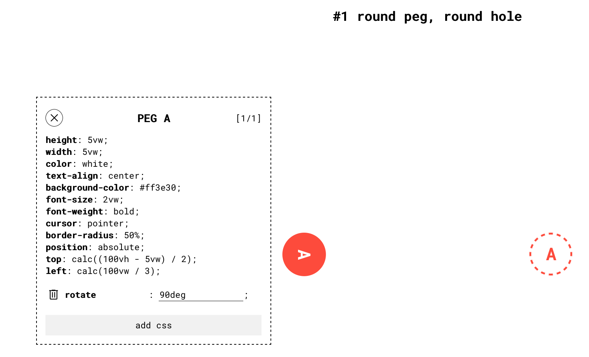

This level can be solved by simply adding some `margin-left` to the peg. As my play-tester (and also first-time CSS user) [Albany](https://albanyblackburn.com) discovered, `padding` is also a valid approach. In general, every level could be solved in more than one way, which is part of the fun.

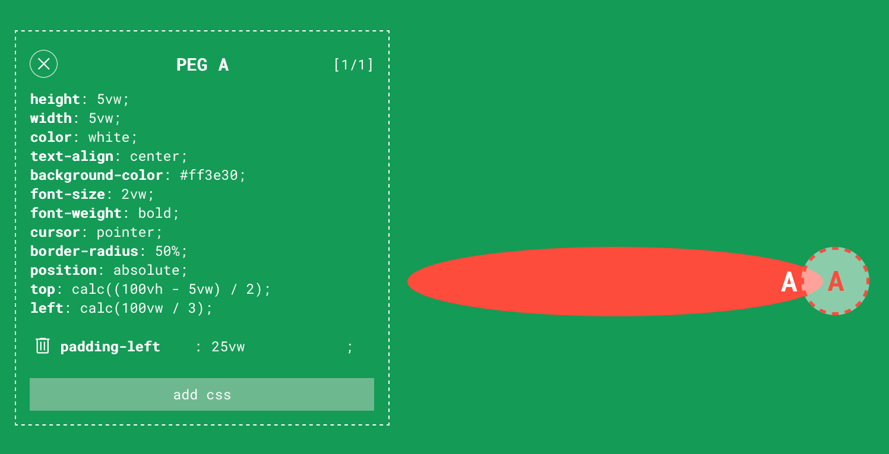

One interesting challenge I ran into early on was implementing a reliable method of checking whether two DOM elements visually overlap. I could get an element's bounding boxes with `getBoundingClientRect()` (see [MDN](https://developer.mozilla.org/en-US/docs/Web/API/Element/getBoundingClientRect)), but that would only work if the elements are rectangles. Even if I made the pegs and holes square, this would exclude `rotate` as an allowed CSS property, which I didn't want to do.

I remembered, though, that there's a surefire way to know all the DOM elements at a particular point: the `elementsFromPoint()` function ([MDN](https://developer.mozilla.org/en-US/docs/Web/API/Document/elementsFromPoint)). This led to my somewhat cursed but functional solution: each time the user modifies a CSS property, it checks the bounding boxes on all pegs and holes. If all the pegs' bounding boxes overlap with their corresponding hole's bounding box, randomly  check 200 points inside the bounding boxes' overlaps. If at least one point hits both the peg and hole in all pairs, it's a solution. It's a hack, for sure, but it allowed me to make virtually no assumptions about which CSS properties players would use.

One lesson I learned in the process of developing CSS Hell was the importance of making it easy to iterate during the prototyping period. After making some initial proof-of-concepts, I took a step back to refactor everything so that I could specify entire levels with just JSON.

```json
// levels.json
{
  "1": {
    "levelName": "round peg, round hole",
    "elements": [{ "id": "p0" }, { "id": "h0" }],
    "hint": "Have you tried moving the peg to the hole?",
    "elementData": {
      "p0": {
        "style": {
          "position": "absolute",
          "top": "calc((100vh - 5vw) / 2)",
          "left": "calc(100vw / 3)"
        },
        "cssBudget": 1
      },
      "h0": {
        "style": {
          "position": "absolute",
          "top": "calc((100vh - 5vw) / 2)",
          "right": "calc(100vw / 3)"
        }
      }
    },
  },
  // ...
}
```

The extra effort paid for itself dozens of times over. By making level design as frictionless as possible from the start, I was able to progress much faster than I could if I had to touch JSX.

In the process of iterating, I also realized that I'd need to restrict the use of some CSS properties if I wanted players to find the more creative solutions. For example, `transform` ([MDN](https://developer.mozilla.org/en-US/docs/Web/CSS/transform)) was problematic since it allows basically any combination of translations, skews, scales, and rotations in a single property.

There was another problem: overriding properties. One hallmark of CSS is the fact that an element's properties can be _overridden_:

```css
.element-one {
  /* The second margin overrides the first. */
  margin: 10px;
  margin: 20px;
}

.element-two {
  /* Result: */
  /* margin-top: 10px */
  /* margin-right: 10px */
  /* margin-bottom: 10px */
  /* margin-left: 20px */
  margin: 10px;
  margin-left: 20px;
}
```

While useful for actual web design, this feature would make it very hard to design interesting puzzles, since the initial set of styles _are_ the levels. If players can overwrite any one of them, then it becomes virtually impossible to design an "intended" solution. It was a difficult choice, since it goes against the ethos of CSS, but I decided that overriding existing properties wouldn't be allowed in the game.[^2]

This also extended to mixed longhand and shorthand properties. That is, if `margin` were already set on an element, then `margin-left`, `margin-right`, etc. wouldn't be permitted. Similarly, if `margin-right` were set, the `margin` shorthand couldn't be used, _but_ other longhand `margin-*` properties like `margin-left` _would_ be allowed. I figured this would give the best balance between having a "direction" for each puzzle without overly constraining the player.

### Playtesting and (locally) launching

With these rules in place, I could get to the most fun part: designing and play-testing levels. This process is perhaps most concisely communicated with two text message screenshots.

The joy of discovering the absolute mania of CSS:

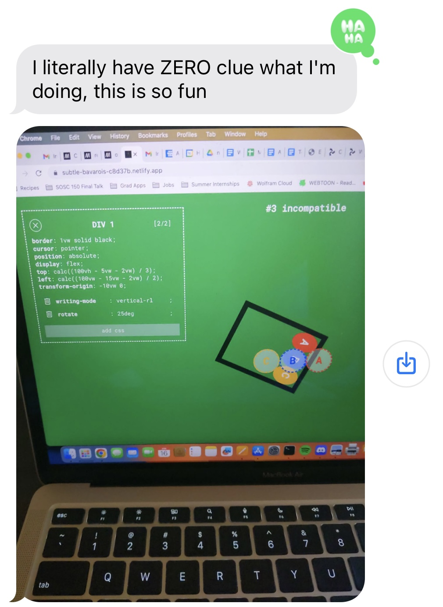

...and the dismay of realizing how diabolical it can get:

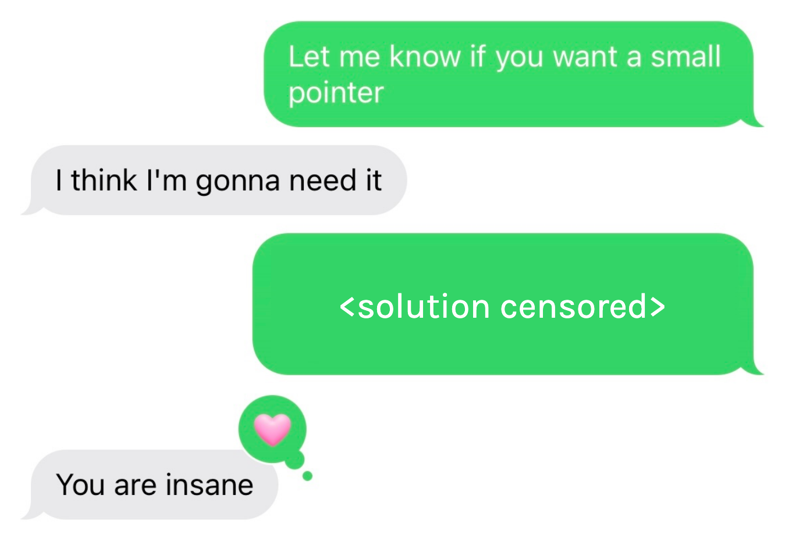

After finishing all 15 levels and adding a few birthday-specific elements, the game was finally ready to launch to its intended target audience of exactly one person. At 2:17 AM on June 24th, I tossed CSS Hell onto a public domain and sent it over to Anshul. After a couple days of frustration, breakthroughs, and occasional troubleshooting, Anshul paid me the highest compliment I could have expected:

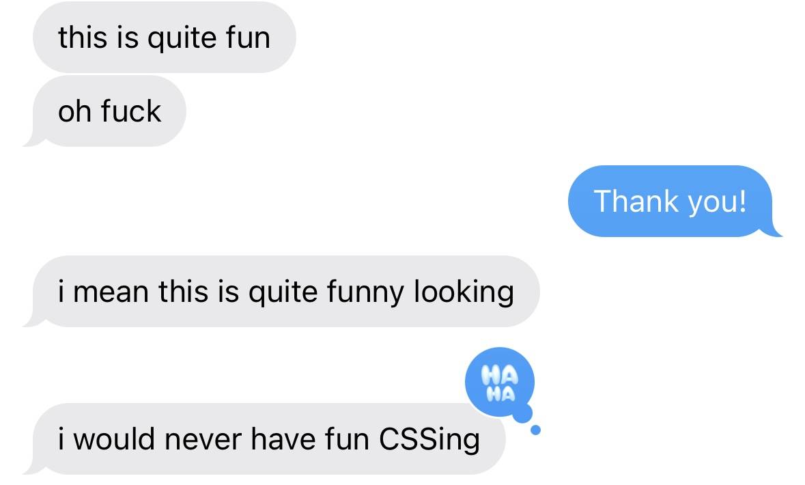

Along the way, we discovered some snags, like one level that depended on a certain CSS property which was only supported on the absolute latest version of Safari. But after remedying that and a few other bugs, I was left with a surprisingly playable CSS-based puzzle game. As far as I was concerned, this was "mission accomplished".

### Surprise CSS Hell revival

Two years later, I remembered my old CSS game. I figured I might as well fix a couple outstanding `TODO`s and share it online, in case any frontend devs get a kick out of it. I removed all the birthday-specific elements, tested each level on the main browsers, and renamed it from Code Monkey to CSS Hell. I also shared it on [Hacker News](https://news.ycombinator.com/), but it didn't gain much attention there.

A week or so later, I woke up and checked my phone to find that multiple pull requests had been made overnight to the `solutions.md` file in my GitHub repo. Strange. I checked the site analytics and was astonished to see the following:

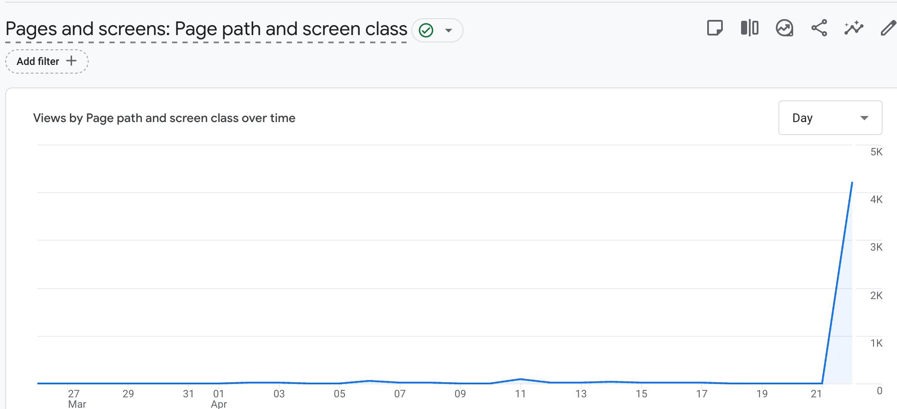

On a hunch, I opened Hacker News and confirmed my suspicion: CSS Hell had been posted again, but this time, the stars aligned and it found its way to the front page.

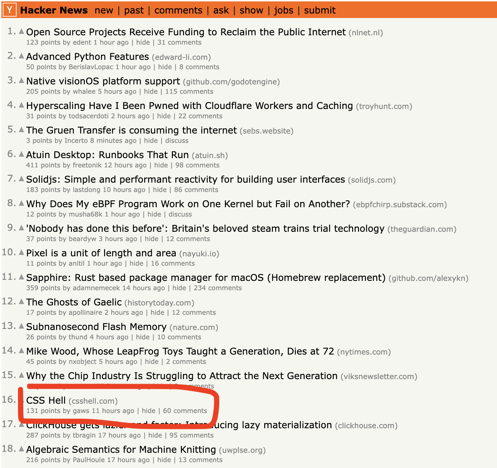

HN commenters certainly aren't shy about sharing feedback, and boy did I get it. Whenever you share something you're proud of on the internet, there's always one comment that haunts you, and for me, it was this one that coolly pointed out my unedited default website description:

> \> Web site created with create-react-app bro...
>
> — _Kamillaova on HN_

Short but devastating. Somehow more devastating than this other one:

> Hopefully "Marcos" doesn't need a job any time soon! :D
>
> — _eek2121 on HN_

Looking though the rest of the (constructive) feedback, the vast majority fall under one of 3 categories:

1. The site should be less mobile-hostile
2. Not realizing pegs only need to _partially_ overlap with the holes
3. Not realizing that existing properties can't be overridden

These were actually very helpful pieces of feedback. For (1), on small screens, I showed a more informative message along with a screenshot of what the gameplay looks like. I also added an option to ignore my suggested minimum width and open the site anyway.

For (2), I made this fact more explicit in the  introduction screen. In retrospect, though, an even better solution would probably be to abandon the "peg" / "hole" terminology in favor of terms that don't carry the implication of fitting perfectly. For example, "ball" and "target" might've been better choices in that regard.

For (3), I realized this was a big design flaw: Although the UI indicates that the player can't add a shorthand property that conflicts with a longhand one (or vice versa), I overlooked the more obvious case when the player simply tries to overwrite an existing property with the exact same property. In that case, the added property is silently ignored. In the words of one commenter:

> I spent waaay too long trying to figure out why my CSS rule didn't work. It doesn't accept me to overwrite an already existing one. The rules did not specify this at all. It is not clear that the game wants me to find _another_ rule that fixes the problem instead of adding a single perfectly valid line of CSS that does it. There is a huge difference between those two. CSS being cascading meaning that any CSS property coming after an initial rule will overwrite the previous one (in part or fully). It would be really nice if the game would tell me if the rule I added wasn't allowed instead of just silently failing to do anything with no feedback.
>
> — _riggsdk on HN_

Couldn't have said it better myself, `riggsdk`. I fixed the UI so that this case was properly handled.

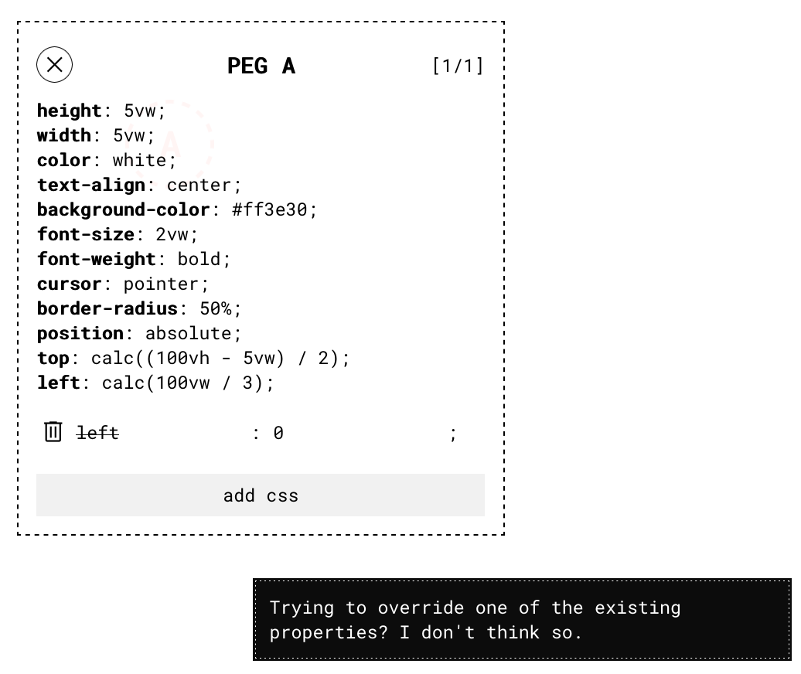

Although the blunt feedback definitely made my game better, I have to admit that I was hoping for a more positive reaction from Hacker News. But a few weeks later, I got this message from my friend Brad:

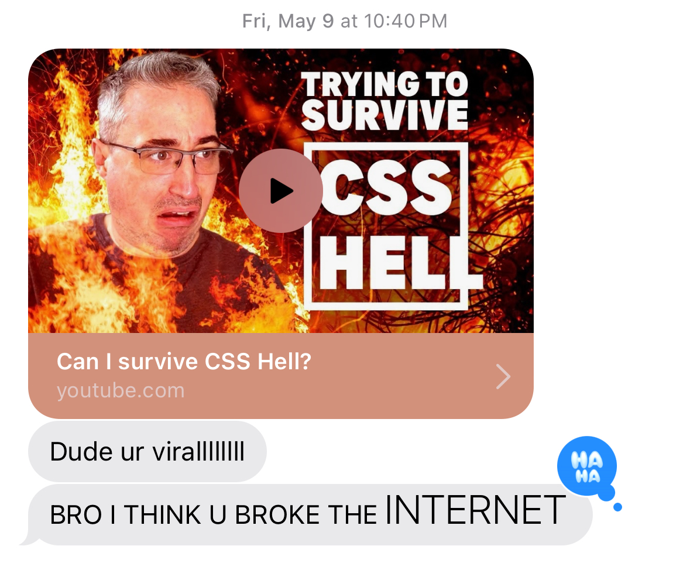

I hadn't seen Kevin's channel before, but I've since been informed that he's essentially "the CSS guy on YouTube". In other words, the exact target audience for my game. It was simultaneously delightful and nerve-wracking to [watch a CSS master work through my puzzles](https://www.youtube.com/watch?v=z6OQO5SwUhU). Countless times, I wanted to yell *"YOU ALMOST HAD IT!"*

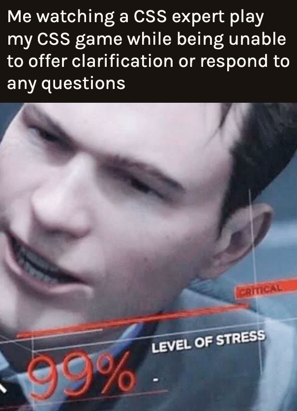

Still, Kevin's playthrough felt like a balm for the hypercritical Hacker News response: I could see him generally having a good time getting nerdsniped, and he avoided obvious cheats that went against the spirit of the game. Kevin's video also gave me the perfect footage I needed to make a [frustration-filled supercut](https://bsky.app/profile/marcos.ac/post/3lowlwaionc2p), and it brought to my attention a few _more_ oversights in the game design. For example, there were a few properties that players could use to sneakily circumvent existing position properties, like `(margin|padding)-(block|inline)-(start|end)` and `inset-*`. But thanks to the magic of open source, those issues were [patched by a contributor](https://github.com/marcos-acosta/css-hell/pulls?q=is%3Apr+is%3Aclosed+author%3AHyftar).

### Reflection

Practically overnight, CSS Hell went from having ~30 page views per week to having 24k in a single week. I'm aware that this number could be a lot bigger; I mean, in high school I made a cringy Reddit meme that got 35k upvotes, and not too long ago I made a [video review of Broadway Junction station](https://www.tiktok.com/@worlds.worst.detective/video/7536241693885009183) that got over 60k views. But this was the most online attention I'd gotten for a game I'd designed, which was personally pretty exciting. It taught me a bunch of technical lessons, as well as some personal ones about handling blunt feedback and not over-indexing on internet success.

I'll close this out with my favorite message I received from a stranger:

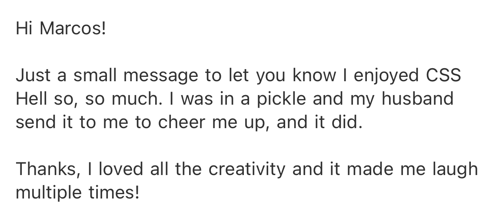

[^1]: People usually use the term "code monkey" in a [certain way](https://www.urbandictionary.com/define.php?term=code%20monkey), but I think in Anshul's case, he just felt that there was something spiritually primate-like about aligning divs and tuning margins.
[^2]: As I write this, I seem to remember that I used to have a little "lock" icon to the left of the initial styles. I'm not sure why I got rid of it, because (as I discuss later) it probably would have greatly clarified the situation for new players.