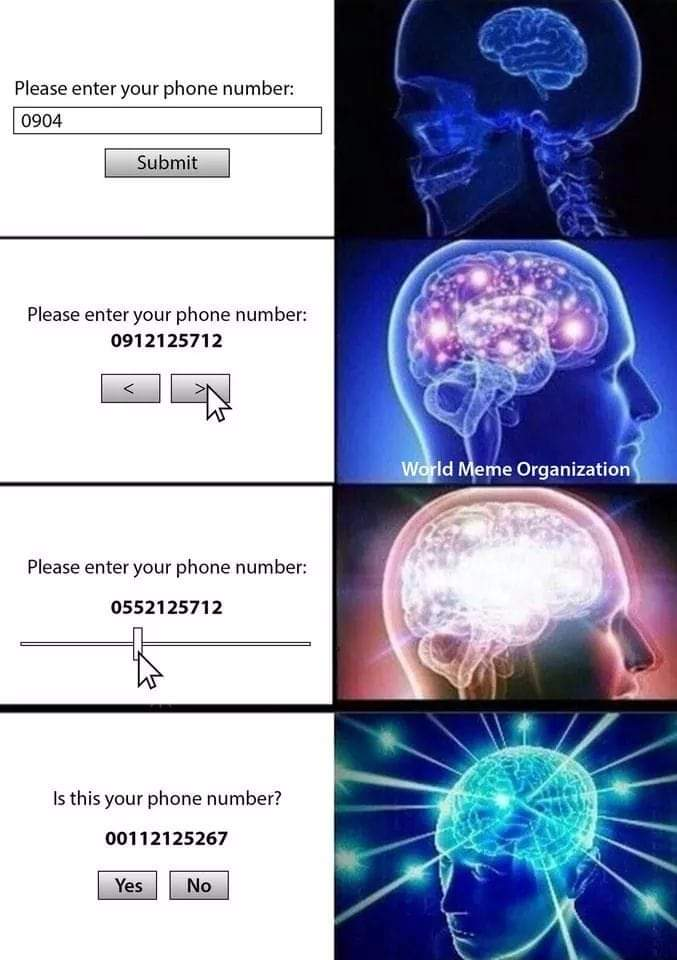

The only good thing about bad design is that it can be really funny. For example, the time that Citigroup accidentally credited a client's account with 81 trillion dollars because an input field came pre-populated with fifteen zeros ([story](https://archive.ph/2025.03.03-183520/https://www.bloomberg.com/opinion/articles/2025-03-03/citi-keeps-hitting-the-wrong-buttons)).

The space of intentionally bad design a very rich one (see [r/badUIbattles](https://www.reddit.com/r/badUIbattles/)), especially since they often exemplify the principles of good design by deliberately flaunting them. I was inspired by these phone number input memes to make an entire signup flow designed to be equal parts infuriating and amusing.

There's not much else to say about it that you can't experience for yourself, so go a head and [sign up](https://cursed-signup.com)!
