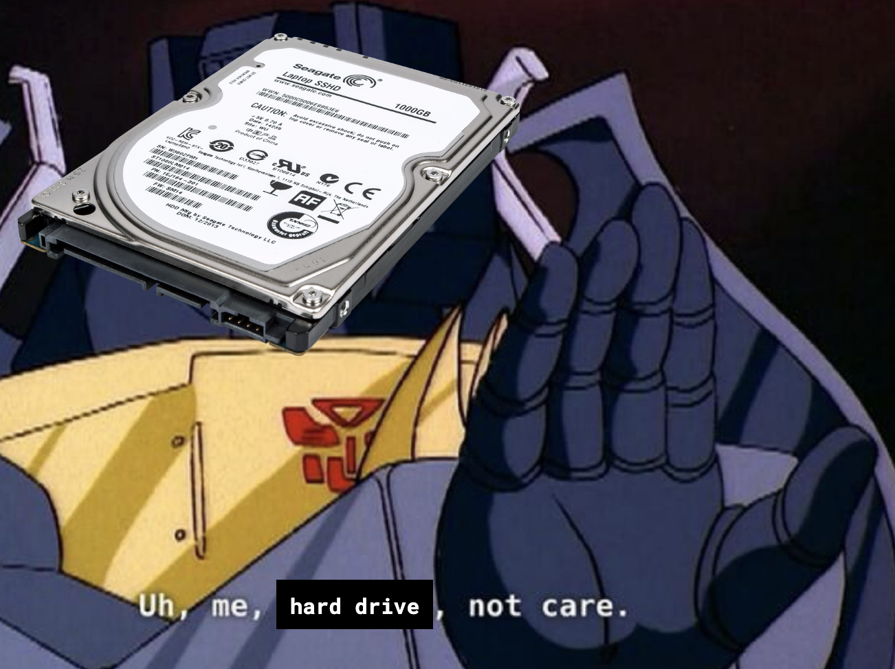
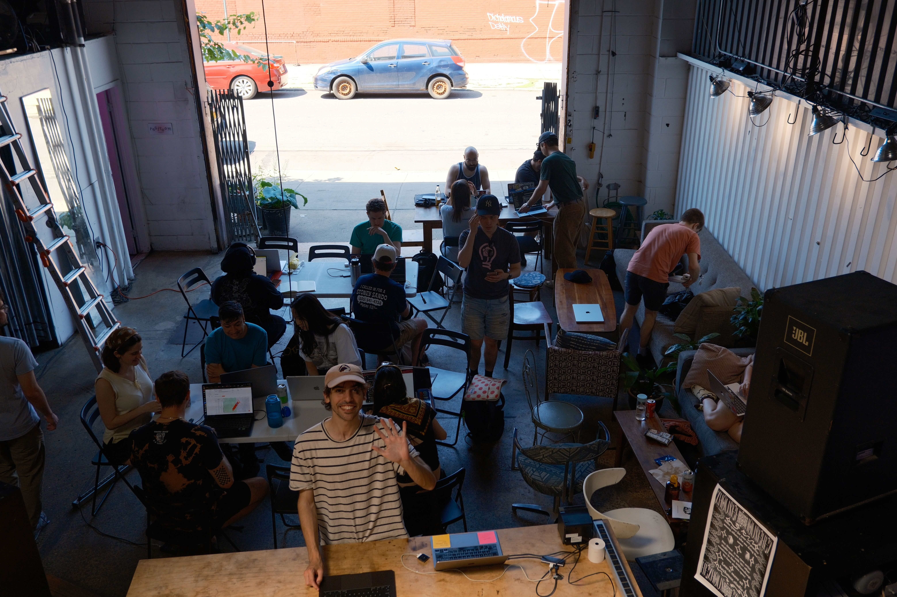
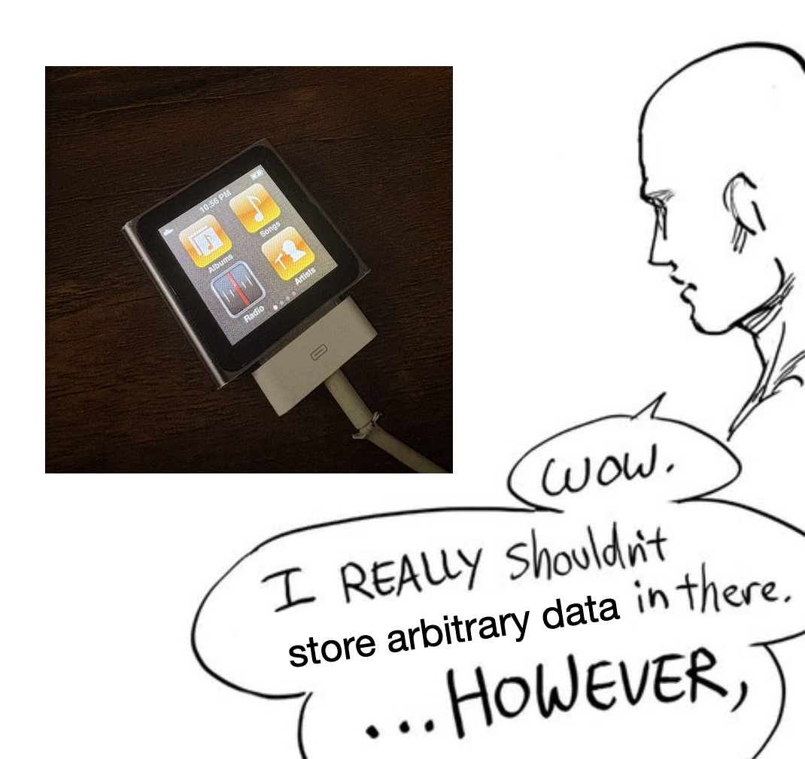
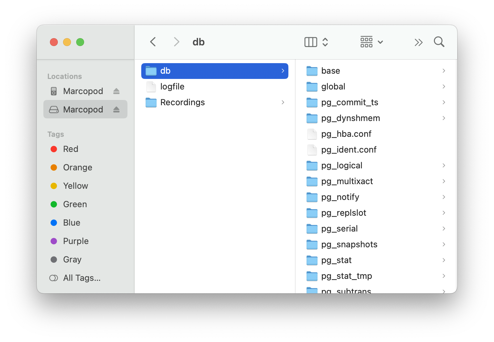
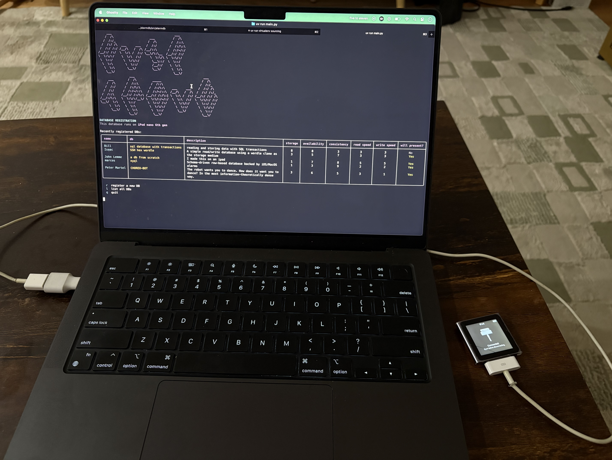

I have this list in my notes app called "Community ideas" which is filled with half-baked and/or cryptic ideas for gatherings like "Meme gallery", "Jaywalk race across Manhattan", and "Google forms" (yes, just "Google forms"). One item on that list was "cursed DB meetup", and this is the story of that.

## How it started

The origin of the idea came from a video from [Tom 7](https://en.wikipedia.org/wiki/Tom_Murphy_VII) (aka suckerpinch) entitled [Harder Drives: Hard drives we didn't want or need](https://www.youtube.com/watch?v=JcJSW7Rprio). Over the course of the video's 36 exceptionally-edited minutes, Tom fashions virtual hard drives out of NES TETRIS, Cue COVID tests, and the IPv4 Internet itself.

In case that last sentence didn't make any sense to you (normal reaction), the core idea is this: traditional computers have hardware specifically designed to store whatever data the user likes. Your hard drive doesn't care whether you're storing images, music, or text: it reads and writes *arbitrary* data.

Compare that to something like TETRIS. Ask anybody ever and they'll tell you that TETRIS is a game, not a file storage service. Yet, TETRIS _does_ store user-generated data, in a way- it stores the positions of the blocks[^1], which the user places. Just like that, there's an in: if you're clever enough, you can find a scheme to turn arbitrary data into TETRIS moves, and then reconstruct the original data from the blocks on the playfield.

There's no _practical_ reason to do this: it's purely for the love of the hack.

I thought: this seems really fun to me, and I bet it would be fun for a bunch of other people too. So, the idea was born: get a bunch of people to make cursed databases and then get together to showcase them!

The only thing I was missing was a name: my first idea was TABLE DROP; (a play on the SQL command for deleting a table and a "drop" in the sense of releasing something cool), but after some user testing, I settled on the more playful FLIP TABLE;.

## Okay, that wasn't the only thing I was missing

With the name out of the way, I just had to secure a venue, attendees, and multiple projects.

This was my first time organizing a large event on my own, so it was a bit of an exercise in manifesting. First, I just started telling people about the event as if it were definitely happening, partially to field interest but also to see if anyone was willing to offer a venue. It seemed like there was interest, so I made a website- that way, if someone asked "so... what's this event?" I could just send a link.

Luckily, I wound up with a few options for a venue- one was a friend's startup's office space, which had plenty of space and lots of monitors. This was very tempting, but I felt like the ethos of the event was somewhat anti-corporate, so it didn't feel like the right fit. In the end, my friend [Sidney](https://s4y.us/) was able to host us at the warehouse studio [Hex House](https://hexhouse.studio/), which was perfect for a few reasons: big space, open-air, artist-run, and the best asset of all, Sidney himself (more on that later).

With a venue and a date locked in, I was able to finalize the event website and create a [Luma](https://luma.com/b9vu7ahb) to start collecting RSVPs. So far, so good!

## Panic time

Two weeks before the event, I started to worry. FLIP TABLE; was a showcase. For that to work, there had to be things to showcase. For there to be things to showcase, I have to rely on people to _do things_. Oh god, what have I done?

At that point, I had about 50 RSVPs, twenty of which said they wanted to make something to showcase, and of those twenty, only three were _for sure_ going to have something ready by the event. I suddenly became terrified that a whole bunch of people would show up for a showcase that would last fifteen minutes.

This turned out to be a lesson in planning an event that can't fail. While my original vision for the event was for it to _not_ be a hackathon, that limitation made the event's success highly dependent on people showing up with projects, which was mostly outside of my control. So, I relented and shuffled the itinerary so that there would be two hours of hacking time.

## Preparations

I didn't want FLIP TABLE; to be just another event- I wanted it to have a strong personality from start to finish. To that end, I undertook a bunch of mini-projects that I hoped would make the event feel unique and well-designed.

### Preparation 1: Sign-ups via iPod Nano

Some folks would arrive with a project ready while others would cook one up during the hacking time. Either way, I needed a way to keep track of who had made something, and if they wanted to present.

Sure, I could use Google Forms. But if I'm hosting an event about storing data in unhinged ways, and I'm storing presenter data in Google Forms, then am I even fit to run this event?

So I looked around my room for inspiration, and my eyes landed on the [iPod Nano](https://marcos.ac/blog/ipod/) that I recovered from my parents' house a few months ago.

Admittedly, I didn't do anything too clever. I just plugged it into my laptop and started a Postgres database with the data directory pointed at the iPod's volume.

The main thing I needed was an intuitive interface for managing signups that would read from and write to the iPod behind the scenes. For that, I was relatively happy to delegate to Claude to create a CLI for exactly that:

Since my iPod could only be accessed from my computer, and I didn't want folks to be competing with me to use my laptop, I dusted off my burner laptop[^2] and installed the CLI on there. That way, it could just sit on a table for the duration of the event.

Step one, complete.

### Preparation 2: Live alignment chart voting

### Preparation 3: Receipts!

### Preparation 4: Prizes

## The day of

[^1]: For you pedants out there, yes, I know they're called tetrominoes.
[^2]: I tried to trade in my 2020 MacBook Air last year, but after I sent it in, Apple decided it was worth only 70 bucks and informed me that they would send it back to me if I didn't respond. I forgot to respond, so they sent it back. At first, I was bummed that my laziness cost me 70 bungos, but I guess [that old parable about the old man and his horse](https://en.wikipedia.org/wiki/The_old_man_lost_his_horse) had a point.