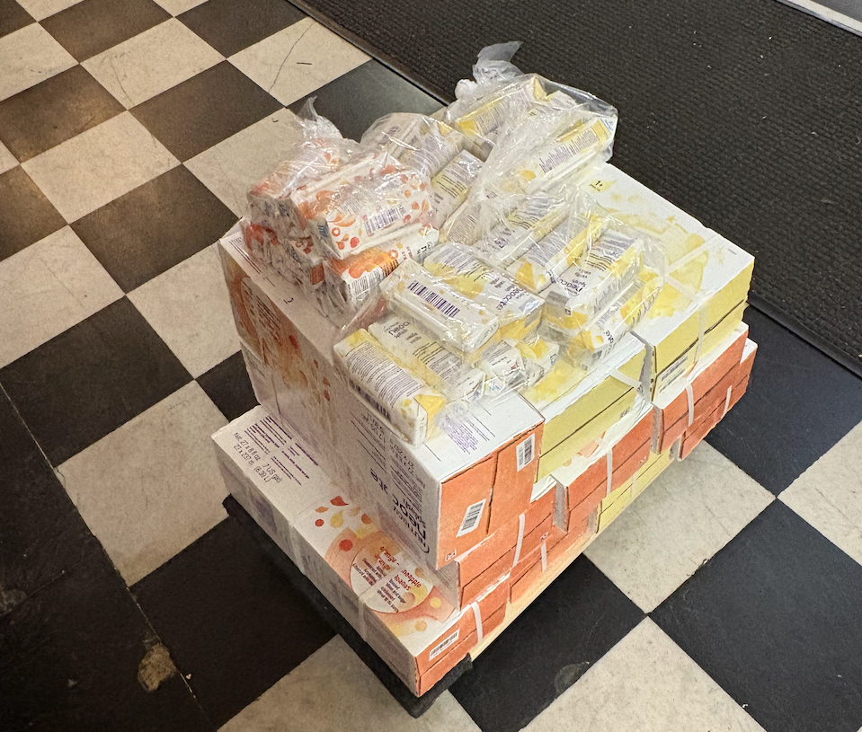
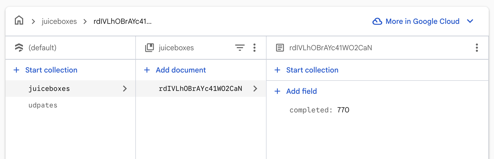

_View the site at [food.marcos.ac](https://food.marcos.ac)!_

## The context

So, I have a condition called [eosinophilic esophagitis (EoE)](https://en.wikipedia.org/wiki/Eosinophilic_esophagitis) that basically causes my throat to close up over time (in the absence of medication) due to a chronic allergic reaction. It's a pretty rare disease, but every once in a while I'll learn of somebody else who has it, like my dentist or John Green. But unlike other allergic conditions where consuming the allergen produces a near-instant reaction, I wouldn't know anything was wrong until about a month of continuous exposure to the allergen, at which point I start to have difficulty swallowing. This makes finding the culprit(s) much less straightforward.

When I was younger, I tried a few [elimination diets](https://en.wikipedia.org/wiki/Elimination_diet). First, we eliminated milk from my diet for two months, but saw no improvement in the endoscopy. Next, we removed milk, wheat, soy, and eggs for another two months. No dice. Undeterred, I went two more months without eating those four ingredients plus corn, potatoes, and rice. Still no good. Finally, I tried a last-ditch attempt which also removed chicken and beef and similarly did not work. At that point, I was a high schooler who just wanted to _eat_. So, I started taking prescription drugs to treat my condition and decided to worry about it later.

Then, later came. I had graduated college and didn't want to take expensive[^1] weekly injections for the rest of my life if I could help it. I was determined to figure out once and for all what I was allergic to, so I turned to the "Plan Z" in these situations: the [elemental diet](https://en.wikipedia.org/wiki/Elemental_diet).

## The elemental diet

I think of the elemental diet as the complement of the elimination diet: instead of eating everything except a small list of ingredients, you eat _nothing_ except a small list of ingredients. The first step was to live solely off of these insurance-covered[^2] [amino acid shakes](https://www.neocate.com/shop/hypoallergenic-formula-and-products/splash) for two months. Assuming that worked, we would slowly re-introduce foods into my diet in small batches every 1-2 months. At that pace, it could easily take two years to build up a normal-looking diet that doesn't trigger my condition. For reference, this is what a 30-day supply looks like:

Those first two months were pretty great, actually. Just kidding, obviously it sucked. I remember the first day especially well. The night before, I'd enjoyed my "last meal"; a philly cheese steak from the corner deli. Waking up and remembering that I had two foodless months ahead of me, followed by a much longer stretch of extremely limited and philly-cheese-steak-less diets was instantly demoralizing. The temptation to give up before I'd even started was overwhelming.

At first, I planned on breaking up my amino acid shake consumption into meals: I would drink two boxes for breakfast, three for lunch, another three for dinner, and another two spread out throughout the day as snacks. That morning, I downed my first two boxes, practically forcing the second one down because the taste was so strange and artificial. I somehow felt hungrier than before. _This doesn't bode well_, I thought. The whole day, I felt hungry and tired.

The next day was a workday that I definitely should have taken off. I decided that I needed to make this diet productive _somehow_, somehow gamify the experience so that I could externalize my progress and see it at a glance. Vaguely inspired by Nolen's [One Million Checkboxes](https://eieio.games/blog/the-secret-inside-one-million-checkboxes/), I got to work.

## My countdown to real food

[The tracker](https://food.marcos.ac) was made more or less in one sitting. I used a Firestore database which contained a list of status updates and a single number, representing the total number of "juiceboxes" drank so far[^3]. I had a number (originally 300, then later 600) representing the number of boxes I'd need to drink before getting a taste of "real" food again.

Unlike a few of my previous web dev projects, I focused on designing the site for both mobile and desktop instead of leaving the mobile experience as an afterthought. One styling trick I learned this time around was the use of `auto-fill` in the `grid-template-columns` CSS property, allowing the number of columns in the juicebox grid to adapt responsively to the available width. I like using Firebase for these one-off projects because (a) it's free, and (b) `react-firebase-hooks` provide super convenient hooks for optimistic updating and component-level reloading when certain collections change.

I had a shortcut on my phone to increment the count and add updates whenever I felt like it. I can honestly say it made a surprisingly big difference to watch that number go up each time I downed a box or two, and to log my journey without food, even if my updates went straight into the void.

Well, not completely into the void. There were a few people that checked in with my website regularly. To those people: thank you so much. I appreciate you.

As time went by, the diet got easier and easier. I suppose my brain learned to associate the amino acid shakes with nutrition, because they started to taste better, and I started to feel full after drinking them. Anticlimactically, the days kept passing, and eventually, I had made it through two months, and an endoscopy proved that my condition had gone away in the absence of food. We take our wins where we can get them.

## The journey continues

This story probably won't have a conclusion for a long time, but I _have_ gotten to eat some food again. Recently, I've been eating pork and quinoa, which isn't half bad if you salt it right. I still go through 8-10 amino acid shakes a day to get my caloric intake. Pork and quinoa is definitely a step up, but I'm still counting the days until I can eat a slice of pizza again, or have some tiramisu.

I decided to stop updating the site, since I no longer need it to motivate me, nor do I have the reflex to increment the counter each time I drink a box. But I'm still very happy with it, since it goes to show that one day of effort can have a positive impact for months to come, if not longer.

## Addendum

Don't take thirty amino acid juiceboxes through TSA.

Also, a lovely wood cake my family made me to celebrate my foodless birthday:

[^1]: Without insurance, my injections would run me $3,993.36 per carton, which would last me two weeks. That or take steriods, which are cheaper, but have well-studied negative side effects.
[^2]: I'm lucky that I was able to get my insurance to cover there. Health insurance companies are notoriously stingy on covering medical food on the basis that they're not a "medical necessity".
[^3]: In retrospect, it would have been smarter to represent this as a list of timestamped increments, so that way I could plot a nice time graph and still get the total by summing the number of rows. Oh, well.