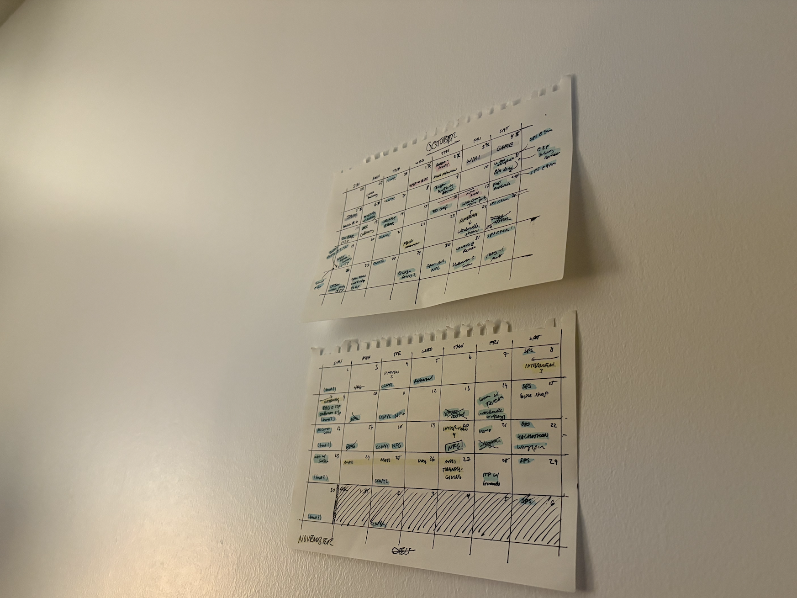
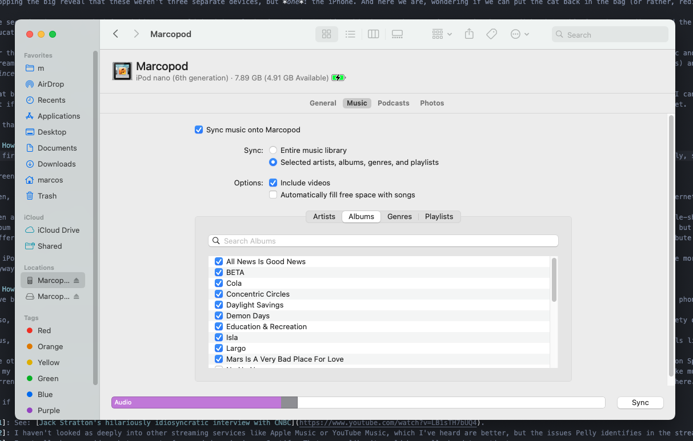
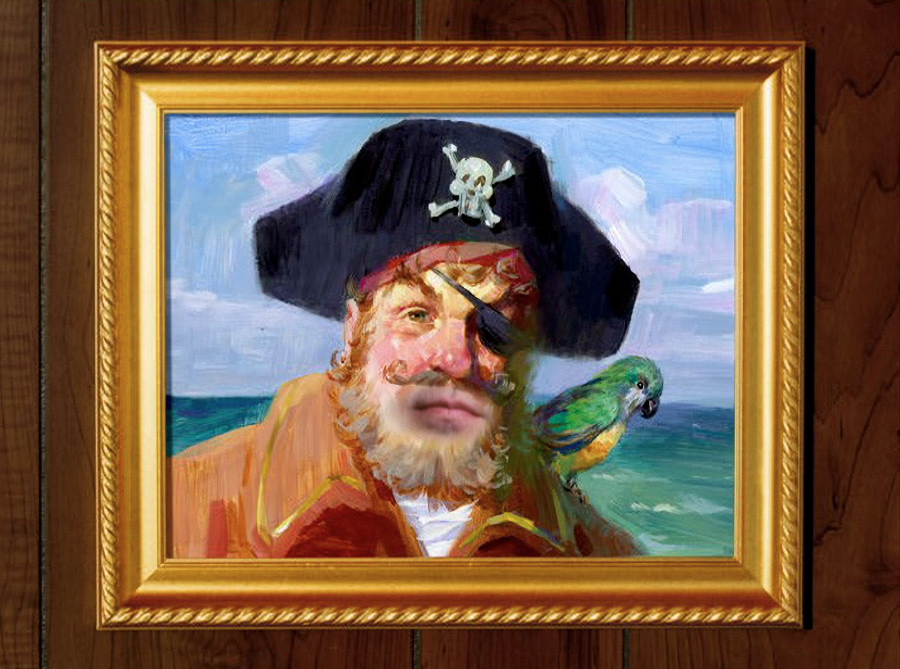

My latest favorite tech gadget is a 13-year-old hunk of metal with a 3.5mm aux port.

## Why?

In a time when you can stream pretty much any song on-demand for ten bucks a month, why bother with literally anything else? For me, there's a few overlapping reasons. 

The first is an overall desire to use my phone for less things. I already keep my phone free of social media, but I'm *still* not happy with the amount I use it. If I'm listening to music on Spotify and I go to switch songs, or even just see which song I'm listening to, I have to check my phone, tempting me to check my email or messages or generally find some way to occupy myself. I don't lose much *time* on that sort of thing, but it does bother me to feel so beholden to my everything-device when I really just want to listen to music. And sure, maybe it's a question of self-control, but to quote James Clear's _Atomic Habits_:

> When scientists analyze people who appear to have tremendous self-control, it turns out those individuals aren’t all that different from those who are struggling.  Instead, “disciplined” people are better at structuring their lives in a way that does not require heroic willpower and self-control. In other words, they spend less time in tempting situations.

I'd rather have a dedicated music-listening device so that I can decouple that activity from all the other virtues and vices of my phone. I recently did a similar thing with my calendar, and have been enjoying it tremendously. Sure, it's not as convenient to check at all times. But I've actually missed *fewer* events since I started keeping a physical calendar because I write them down by hand and see them every day when I get out of bed. A tab on a computer is easy to forget about.



I also recently got a radio, which is especially funny, since even my *iPod* has a radio feature. But similarly, I enjoy having a separate object for a separate activity.

I like to wonder what Steve Jobs would have thought about all of this. In his [now-famous 2007 keynote presentation at MacWorld](https://youtu.be/x7qPAY9JqE4?si=biQjk49bGm2Uz_dn&t=79), Jobs confirmed the release of a new music player, a phone, and an "internet communications device" before dropping the big reveal that these weren't three separate devices, but *one*: the iPhone. And here we are, wondering if we can put the cat back in the bag (or rather, redistribute multiple cats in the same bag to separate bags).

The second main reason I had for picking up my old iPod is a lack of trust in Spotify. This is somewhat new for me; I've been a diehard Spotify fan since I discovered the app in 2014, even applying for a software engineering internship when I was in college. Since then, though, I've been educated on how the sausage gets made at Spotify, and it's not pretty.

For the whole story, I highly recommend Liz Pelly's book *Mood Machine*, but if I had to summarize the main idea in a few words, it would be: Spotify commodifies music and generally does everything in its power to pay artists less. For one, of course, there's the ridiculously low payout per stream[^1]. For another, Spotify is known to contract musicians to pump out vibey tracks that they can cram into their most popular playlists (under bogus artist names) and pay cheaper royalty rates. Plus, when you trace the origins of the company, you see that Spotify's leadership has _since the beginning_ seen music primarily as a tool for advertising. Suffice to say, I'm not a huge fan of Spotify.[^2]

That brings me to my third reason, which is that my saved music on Spotify doesn't feel precious to me. At least, not as precious as I'd like it to be. With Spotify, I can borrow any song ever recorded[^3], but none of it is mine. Ownership is weird, and it's hard to explain why it matters. But if an album is meaningful to me, I'd like to have a copy, even if it's more or less indistinguishable from Spotify streaming those same bits to me over the internet.

So that's why I picked up the iPod.

## How I use it

At first, I wasn't even sure whether I'd be able to upload music to my iPod, considering how many versions of MacOS have gone by and the axing of iTunes. But remarkably, syncing music to your iPod nano is still supported in the year of our Lord 2025.



Then, there's the question of where I get the music. Of course, there's always the tried and true method that our forebearers have pioneered since the dawn of the internet:



Then again, pirating _all_ my music would be monetarily infinitesimally worse for the artists that I'm claiming to support. So, while I get most of my music from the file-sharing service [Soulseek](https://www.slsknet.org/news/), about every month or so (or when nobody on Soulseek has the album I'm looking for), I'll buy an album directly from the artist on Bandcamp. How I see it is, while some artists won't get the cent or so they'd have gotten from my Spotify streams, for other artists, my $10 is about ten thousand times greater. It's actually not so different from an interesting proposal highlighted in *Mood Machine* where users would pay a monthly fee for streaming, but they get to choose which artists to distribute that $10 to.

My iPod has "only" 8 gigs of storage, which means I usually don't download the super-high-quality FLACs, opting instead for the layman's compressed mp3s so I can store more music. I'm usually listening to music with earbuds on a noisy train, so I highly doubt I'd notice the difference anyway. To actually get the albums onto my iPod, I just need to import them via the Music app so that they can be synced. Every couple of days, I'll download a new album or three and sync them to my iPod, evicting albums to clear up space as needed.

## How I've been liking it

I've been liking it a lot. For one thing, with a dedicated music player, I can put my phone in my backpack when I'm out of the apartment. It's a relief to not feel my phone in my pocket, where the temptation to whip it out "just to check" is eliminated.

Also, the decision paralysis I often feel on Spotify is gone, since I only have to choose from the albums I currently have downloaded. I make sure to keep a wide variety of music on there so that I always have a couple options for the mood I'm in.

Plus, adding new albums to my iPod is actually an enjoyable experience. Whereas "saving" a song on Spotify doesn't feel like much, downloading an album to my iPod feels like adding something special to my collection that I'm then actively looking forward to listening to.

The other thing I didn't expect to make such a difference was no longer having the burden of *evaluating* every song in an album. I wasn't even aware I did this, but on Spotify, there was a constant background process in my head to decide whether I liked the current song *enough* to add it to (or keep it in) my playlists. I'd also be juggling other considerations, like whether I already had too many songs of the same vibe. It might not sound like much, but it was a constant metacognition, and it occurred _while_ I was listening to music.

In the first few days of using my iPod, I'd frequently catch myself evaluating the current song like that: "how *much* do I like this song?" It came as a huge relief to realize I didn't need to do that anymore. I could just listen to the song.

There's two other minutiae I like about the iPod: the clip on the back (so convenient!) and the fact that "Artists" and "Composers" are two separate apps, the latter of which I never use, but nevertheless appreciate the existence of.

So if you've got one of these things lying around– try it out again, you might like it more than you think.

## Addendum

I added this command to my aliases to add cover art to a folder of `mp3`s, in case the ones I downloaded are missing it:

```sh
add_cover_to_mp3s() {
  local cover_image="$1"

  if [ -z "$cover_image" ]; then
    echo "Usage: add_cover_to_mp3s /path/to/cover.jpg"
    return 1
  fi

  if [ ! -f "$cover_image" ]; then
    echo "Error: Cover image not found: $cover_image"
    return 1
  fi

  for file in *.mp3; do
    # Remove old covers and add new one to a temp file
    ffmpeg -i "$file" -i "$cover_image" -c copy -map 0 -map -v -map 1 -metadata:s:v title="Album cover" -metadata:s:v comment="Cover (front)" "temp_$file" -y

    # Overwrite original file with the new one
    mv "temp_$file" "$file"
  done

  echo "Done"
}
```

[^1]: See: [Jack Stratton's hilariously idiosyncratic interview with CNBC](https://www.youtube.com/watch?v=LB1sTH7bUQ4).
[^2]: I haven't looked as deeply into other streaming services like Apple Music or YouTube Music, which I've heard are better, but Pelly's arguments against the streaming model in general has curbed my enthusiasm for those alternatives anyway.
[^3]: Okay, yes, not _all_ recorded music, but you know what I mean.