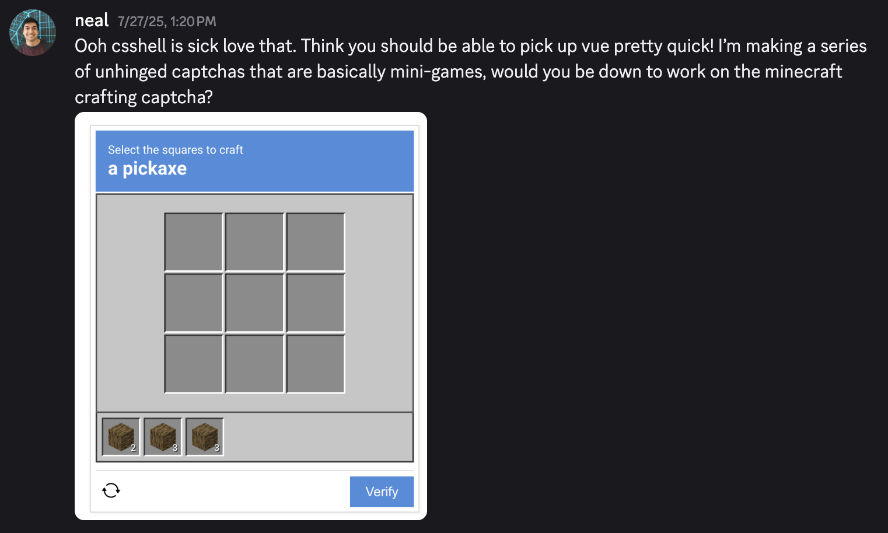

I had the priviledge of contributing a small part to [Neal](https://neal.fun)'s CAPTCHA-based game, [I'm Not A Robot](https://neal.fun/not-a-robot/). The premise of the game involves solving a series of over fifty absurd CAPTCHA-like tasks in order to prove your humanity. I had recently made a [game of sorts](http://localhost:4321/blog/cursed-signup/) that involved parodying CAPTCHAs, so I was very down to help. The CAPTCHA I was tasked with creating was one near and dear to my heart: the Minecraft crafting table.

As a longtime React user, this was my first time using Vue, which took a bit of getting used to with its emphasis on event-listeners. More than a couple times I had to fire up Minecraft just to check what the "official" crafting table behavior is. It kind of felt like being asked to draw a bike: I've ridden one a hundred times, but there are certain details I'd be suddenly unsure of. The crafting table has a bunch of design decisions and edge cases that I never thought twice about, like:

* Highlighting the inventory slot the mouse is currently hovering over
* Splitting an odd number of items in half (pick up the bigger half)
* Swapping items when the user clicks on an inventory slot while already holding an item that cannot be stacked together
* Moving held items back to their previous slot if the user tries to drop them in an invalid spot
  * Involves undoing crafting, if the user picked up a crafted output
* Handling mobile (drag instead of click)

Neal and I settled on a diamond pickaxe for the "target item" the player needed to craft because it wasn't an obscure recipe, but it required a couple steps: craft wooden planks from the logs, then sticks from the planks, and finally the pickaxe from the planks and diamond. One interesting consequence of this was that I needed to find _all_ the recipes that the player could conceivably craft from the initial items (two logs and one diamond), because I didn't want to cut corners. For example, the user could make wooden stairs from six of the wooden planks, or a jukebox from all the wooden planks and the diamond. To be honest, I don't remember how I managed to come up with this comprehensive list (oops), but the end result was a non-watered down crafting table.

I was thinking of adding some additional nice-to-have features from the original game, like dragging across multiple slots to distribute in-hand items, but we decided it wasn't really worth the extra effort.

All things considered, though, it was pretty straightforward. Props to Neal for making the vast majority of the levels, each of which is impressive in its own right. When the game was released, I got to watch some streamers play through the game and was delighted to see that they were able to treat it exactly like the in-game crafting table and [breeze on through](https://youtu.be/JVbZiEkFkyU?si=fQrxioqAedlB5IaQ&t=272).