In May, I was organizing [FLIP TABLE;](https://fliptable.nyc/), a hackathon and showcase centered around cursed databases. The idea was simple: take something that was not designed to store arbitrary data, and store arbitrary data on it. While I was mostly interested in showcasing other people's crazy ideas, I also wanted to build something for myself. But what?

The origin of the idea came from my friend Ava:

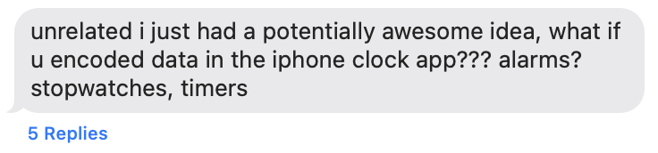

Cool idea, but not possible. Apple doesn't expose an API for accessing alarms- except, I guess, there's the Shortcuts app. But the logic for encoding arbitrary data into alarms and decoding it back out would be way too complex to put into a Shortcut- unless, of course, you used the `Run Shell Script` action to run an arbitrary script... oh god, I've been nerdsniped.

## Representing byte-addressed memory with alarms

Before we can talk about how to represent a schemaful database with alarms, we need to figure out how to represent structured data with alarms, and before we do _that_, we need to understand the anatomy of an alarm.

### The anatomy of an alarm

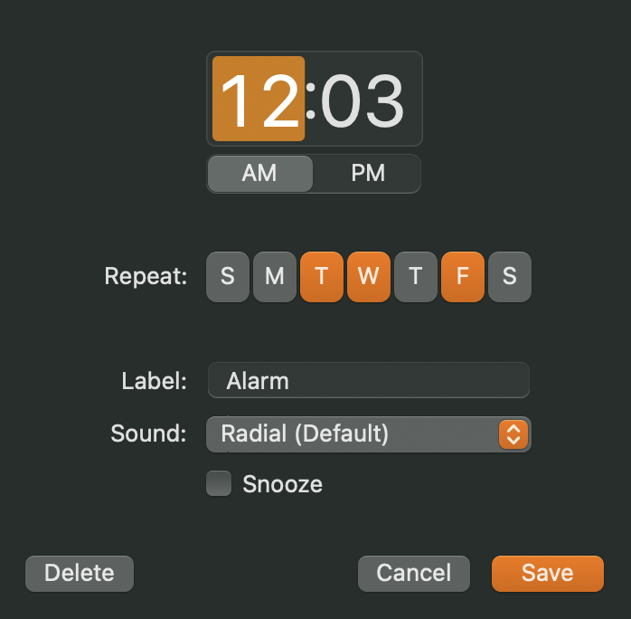

All in all, an alarm has the following pieces of accessible[^1] data:

| What | Description | Bits | Notes |
| - | - | - | - |
| Time | 12:00 AM - 11:59 PM | 10.49 | `log2(60 * 24)` |
| Repeat days | Any combination of weekdays | 7* | More on this later... |
| Enabled | Enabled or disabled | 1 | |
| Allow snooze | Yes or no | 1 | |
| Label | Arbitrary string | N/A | I avoided using this when possible |

So all together, if you ignore the label and the half-bit we get from the time, each alarm carries 19 bits, or just over two bytes.

### A Shortcuts bug cost me one bit

While trying out the Shortcuts actions for reading alarms, my Shortcut would sometimes fail with an extremly helpful "There was a problem" error message.

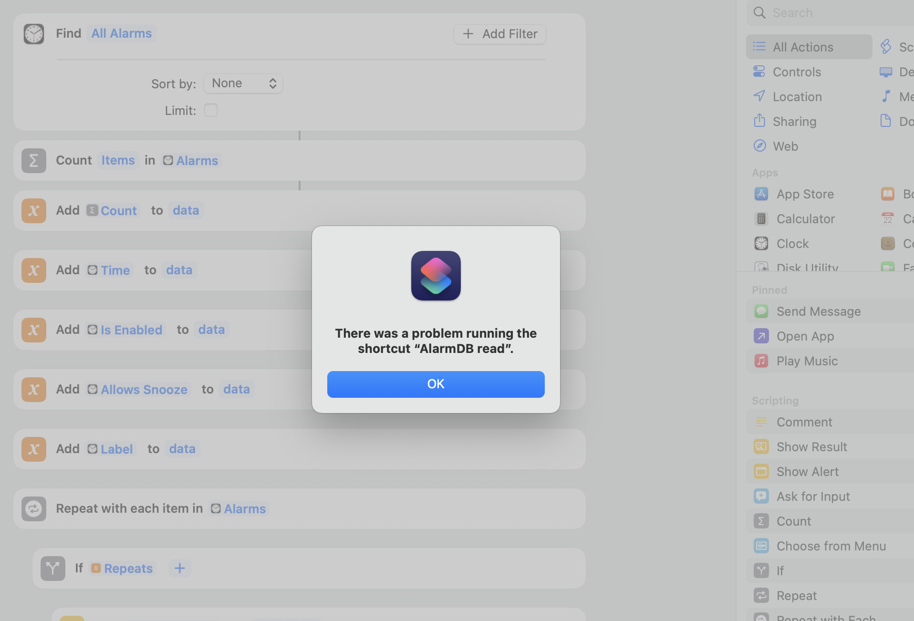

I figured this was probably some subtle bug in my string manipulation, but as I started troubleshooting and stripping away any real logic, I was left with a truly baffling bug.

To illustrate the bug, I created an alarm with "Repeat Days" set to Sunday and Monday and ran a Shortcut that just prints the repeat days:

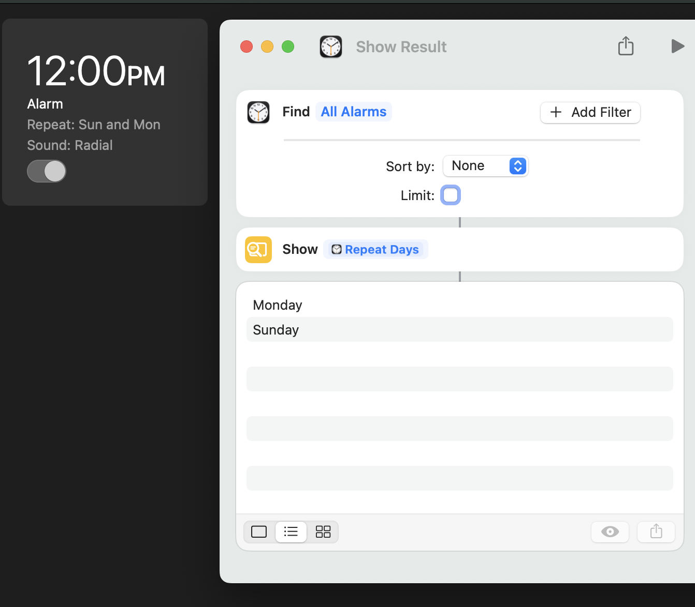

No surprise there: it prints Monday and Sunday, as expected. Now, change the alarm's repeat days to just Monday.

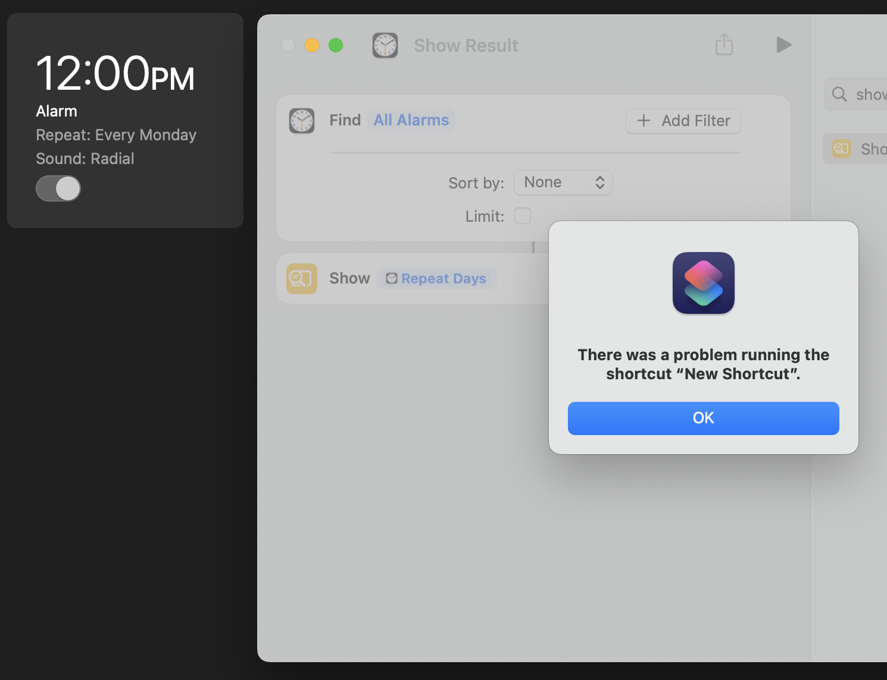


It turns out there's an [already-reported bug](https://discussions.apple.com/thread/256008048?sortBy=rank) where attempting to read an alarm's repeat days fails when there is exactly one repeat day. Not zero, not two, but one. I can only assume this is a kind of internal type error along the lines of:

```js
function getRepeatDays(alarm) {
  if (alarm.repeatDays.length == 1)
    return alarm.repeatDays[0]; // singleton
  else
    return alarm.repeatDays; // list
}

function doSomethingWithRepeatDays(alarm) {
  // error!
  for (const repeatDay of getRepeatDays(alarm)) {
    // ...
  }
}
```

Regardless of why, we now need to make sure that _no alarm has exactly one repeat day set_, which requires sacrificing one bit of data.

Instead of all seven days being used for data, only Monday through Saturday will carry data and Sunday[^2] will be on or off _as necessary_ to prevent the failure mode from happening. As an example, if we wanted to represent `001000` in the repeat days, we would turn the third day on (Wednesday, since we're starting from Monday), but since that would cause a read error thanks to the Shortcuts bug, we _also_ turn on Sunday. When decoding the data, Sunday is ignored- its only function is to prevent crashes.

After sacrificing a bit, we're down to 18 bits per alarm.

### Byte-addressed memory

The first design challenge I ran into was deciding how to represent a single "record" or "row" in the database. My first idea was the most obvious one: one alarm, one record.

This doesn't work because an alarm has only 18 bits. That's plenty if you want to store two UTF-8 characters and two booleans, but we want more. This means that we _have_ to chain multiple alarms together to form a single record, which introduces a new challenge: how will we know which alarms come together to form a record?

No matter how you slice it, we have to sacrifice some of our 18 bits to an "address" of some kind that can be used to group alarms together, similar to how a single string can span multiple bytes of contiguous memory on a computer. I settled on a scheme where the alarm's time would serve as its "address" (10 bits) and the rest of the alarm data (repeat days, enabled, snooze) would contribute their bits to a single data byte.

For example:

```
Time: 1:25 PM => minute 805 => 0001010101

Repeat days: Wed & Fri => (0)001010
Enabled: Yes => 1
Snooze allowed: No => 0

0001010101 001010 1 0
<--------> <-------->
 address      data
```

There you have it: byte-addressed memory from alarms.

## Schema and database layout

So, we can now interpret alarms as byte-addressed memory, but it's not quite a database yet. We're still missing:

- A concept of "records" or "rows"
- A concept of schema

The first one was pretty straightforward: I decided that one "row" of data would be represented by 32 contiguous bytes, meaning that the total `10^10 = 1024` address space actually breaks down into a database with a maximum of 32 rows, each capable of storing up to 32 bytes.

Now, a row might be anything- it could be a student with a first and last name, age, and GPA, or it could be a product with an id, price, date stocked, and description. We need some way to store the _schema_ of the database, so that reads and writes can be encoded and decoded correctly.

It might seem that we don't have anywhere to put the schema, but we do! Remember how I mentioned that the alarm time can represent 10.49 bits? We only use the full 10 bits i.e. `0` (12:00 AM) through `1023` (5:03 PM) for database rows. We still have 416 addresses at our disposal (5:04 PM - 11:59 PM), and that's where the schema will be stored.

Schema alarms are interpreted as follows:
- Time (11 bits): Address
- Next 3 bits: Data type (`0` = `TEXT`, `1` = `UINT`, etc.)
- Last 5 bits: Length in bytes

For example:

```
Time: 5:04 PM => minute 1024 => 10000000000

Repeat days: Wednesday & Saturday => (0)001001
Enabled: No => 0
Snooze allowed: No => 0

10000000000 001 00100
<-address-> ^   Length in bytes (4)
            Data type (1 = unsigned int)

=> 4-byte unsigned int
```

As for the field name? I... caved and put it in the alarm's label. I know, I know. There _is_ a pure way to do it (cap field names at 12 characters and store them as UTF-8 strings in the rest of the unused address space), but sometimes you're in a moment of weakness and there's an arbitrary string field staring you right in the face.

I decided to support six data types:

| Enum | Data type | Representation |
| - | - | - |
| `0` | `TEXT` | Null-terminated UTF-8 string |
| `1` | `UINT` | Unsigned int |
| `2` | `INT` | Two's-complement signed int |
| `3` | `TIMESTAMP` | Unsigned int (interpreted as seconds since epoch) |
| `4` | `BOOLEAN` | `FALSE` if `0`, `TRUE` otherwise |
| `5` | `FLOAT` | IEEE 754 single-precision float |
| `6`, `7` | (unused) | |

## The query language: NyQL

So a database is great, but what good is it if you can't _query_ it? Thus, running with the theme of sleep and alarms, NyQL was born. It copies the syntax of SQL while supporting a limited subset of its features: schema definition, `INSERT`, `UPDATE`, `DELETE`, and `SELECT`, aliases, `WHERE` clauses with boolean logic, `ORDER BY`, `GROUP BY` with the usual aggregations (`SUM`, `COUNT`, `MIN`, `MAX`, `AVG`), and arithmetic.

### Where do you run NyQL?

_Anywhere_! Literally anywhere you can highlight and right-click text can become a NyQL IDE- Notes, Messages, even this web page.

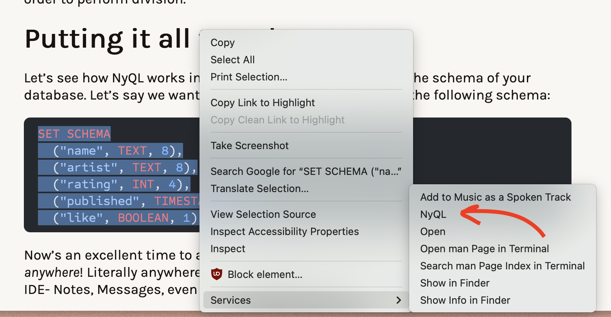

Hell, you could even run NyQL from the Clock app if you find a text field:

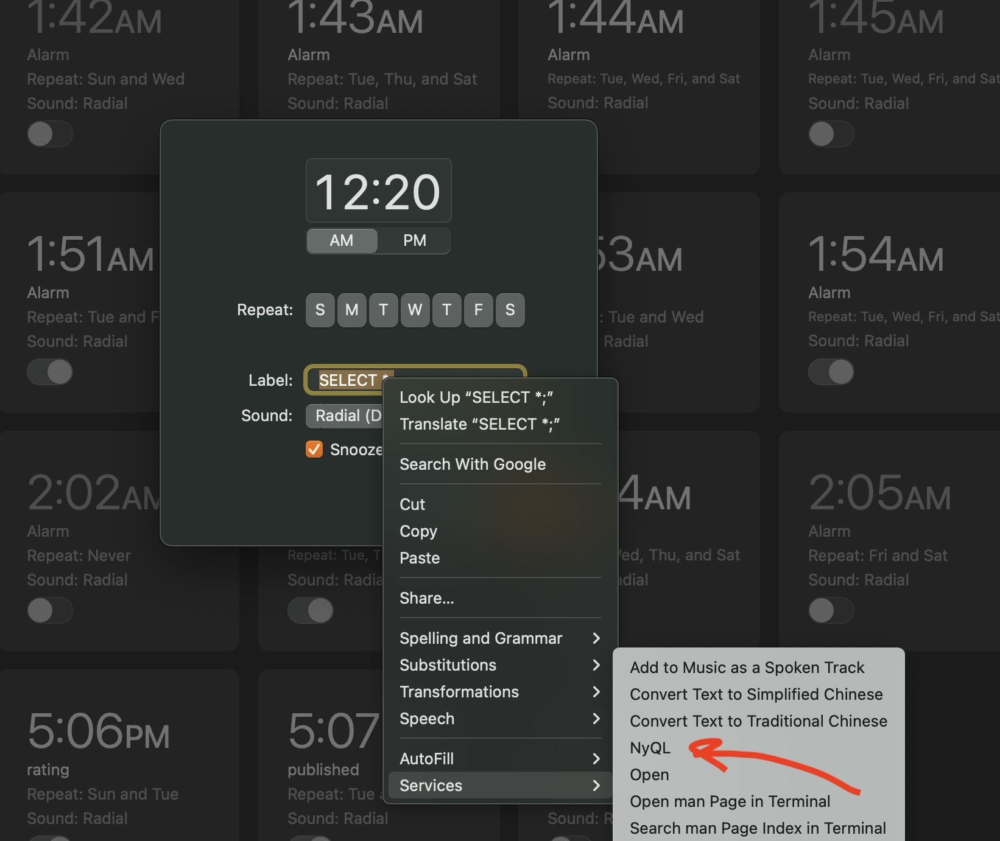

## Defining a schema

Let's see how NyQL works in action. Let's say we want to catalog albums, so we define the following schema:

```sql
SET SCHEMA
  ("name", TEXT, 15),
  ("artist", TEXT, 8),
  ("rating", INT, 4),
  ("published", TIMESTAMP, 4),
  ("like", BOOLEAN, 1);
```

When the `NyQL` Shortcut is triggered on the above, it does two things: first, it calls the `NyQL read` Shortcut, which simply reads all the alarms and serializes them into a single string. There are no alarms yet, so we can ignore this step. Then, it concatenates the serialized alarm data with the query string and passes that along to a Python script via the `Run Bash Script` action.

There, the query gets parsed into an Abstract Syntax Tree (using the [Lark](https://lark-parser.readthedocs.io/en/latest/index.html) Python library) and then transformed into a much more semantic data structure:

```py
SetSchemaStmt(cols=[
  SchemaCol(name='name', type='TEXT', length_bytes=15),
  SchemaCol(name='artist', type='TEXT', length_bytes=8),
  SchemaCol(name='rating', type='INT', length_bytes=4),
  SchemaCol(name='published', type='TIMESTAMP', length_bytes=4),
  SchemaCol(name='like', type='BOOLEAN', length_bytes=1)
])
```

This gets passed to the NyQL engine, which takes in a `Statement` like the one above and turns it into either (a) a result to display or (b) a set of instructions to pass along to the `NyQL write` Shortcut. In this case, since creating the schema involves writing, the engine outputs the following instructions:

```
RUN
ADD|5:04 PM|saturday friday|false|name
ADD|5:05 PM|saturday sunday|true|artist
ADD|5:06 PM|tuesday sunday|true|rating
ADD|5:07 PM|wednesday tuesday|true|published
ADD|5:08 PM|monday sunday|false|like
DISABLE|5
```

The `RUN` tells the main `NyQL` Shortcut to pass the remaining lines to the `NyQL write` Shortcut, which dutifully follows the instructions. You might notice the odd-one-out: `DISABLE|5`.

### When writing one byte takes two steps

It turns out that _you can't create a disabled alarm_.

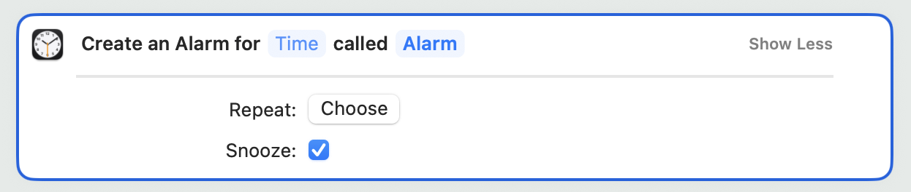

It makes sense when you think about it. Who wants to create an alarm that _doesn't_ go off by default? Well, since it's a data-carrying bit, us.

To get around this, I did something pretty hacky, which is to _simulate_ the instructions while they're being generated in order to track the _indices_ of the alarms, so that when it needs to create an `ADD` instruction for an alarm that should be disabled, it can tack on a `DISABLE` instruction with the index of that alarm. The `NyQL write` shortcut can then use that index to locate the alarm and disable it with the `Toggle Alarm` action.[^3]

### The database asks for permission

One funny side-effect of using Apple alarms as your database is that certain actions _require_ user input. For example, every time an alarm is disabled, there's an unskippable, blocking user prompt.

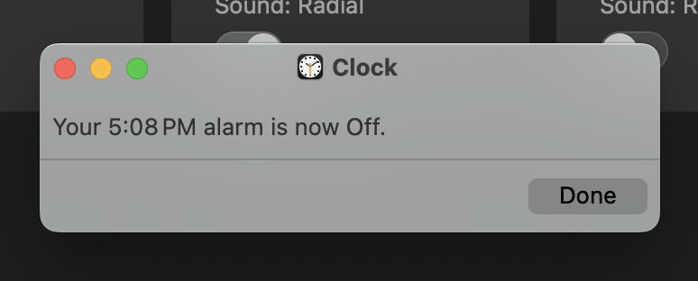

But after providing the necessary user input, we can see that the schema has been successfully encoded in alarms:

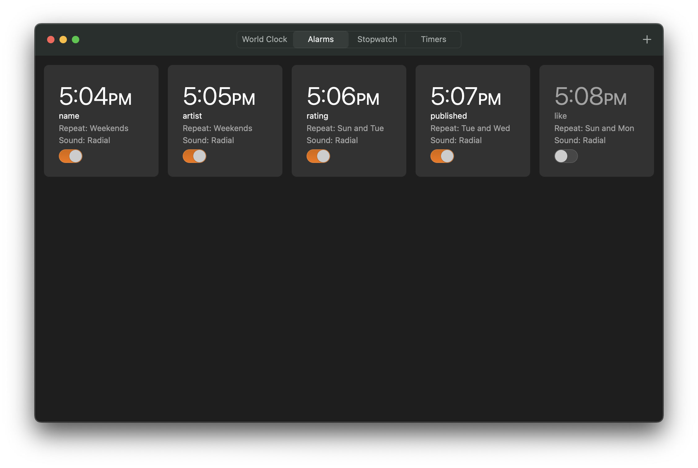

## Inserting data

Now that we have the schema set in place, it only makes sense to add a few records:

```sql
INSERT VALUES
  ("Madvillainy", "MF DOOM", 8, 985323600, TRUE),
  ("Nevermind", "Nirvana", 6, 685684800, TRUE),
  ("The OOZ", "K Krule", 7, 1507867200, TRUE),
  ("Djesse Vol. 3", "Jacob C", 1, 1597377600, FALSE);
```

This time, there actually _are_ alarms in the database to read. The `NyQL read` Shortcut is dispatched and spits out the following pipe-delimited[^4] string of raw alarm data:

```
5|5:04 PM|5:05 PM|5:06 PM|5:07 PM|5:08 PM|Yes|Yes|Yes|Yes|No|No|Yes|Yes|Yes|No|name|artist|rating|published|like|Friday Saturday|Saturday Sunday|Tuesday Sunday|Tuesday Wednesday|Monday Sunday
```

These get passed to the main Python engine along with the original query. Putting the parsed statement and the decoded schema together, the engine can generate the instructions for writing the alarms that encode the given values. The full instruction output is pretty huge:

```js
RUN
ADD|12:00 AM|saturday friday tuesday|true|Alarm
DISABLE|1
ADD|12:01 AM|wednesday tuesday|true|Alarm
DISABLE|2
// ... 135 instructions later ... //
ADD|2:05 AM|saturday friday|false|Alarm
DISABLE|90
ADD|2:06 AM|tuesday sunday|false|Alarm
DISABLE|91
```

Remember that one blocking dialog box? Well, this time you have to click through _fifty-two_ of them.

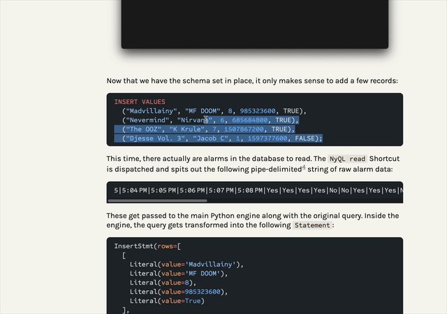

After all is said and `Done`, though, our four albums have been encoded with 96 Apple alarms.

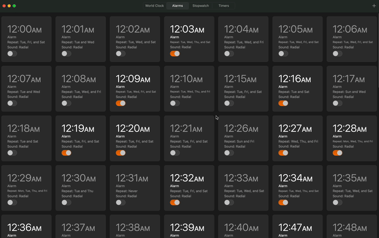

## Querying

Just to bring it home, let's test a nontrivial `SELECT` statement:

```sql
SELECT like, AVG(rating / 10) AS avg_rating GROUP BY like;
```

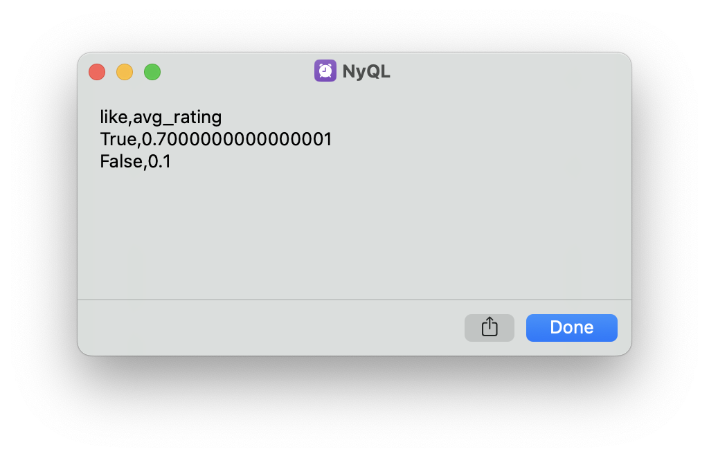

Gotta love floats.

## Closing time

I presented AlarmDB at FLIP TABLE; ([talk link](https://fliptable.nyc/#nyql)) and earned the "most data" award, although I suspect the vote was biased since I was organizing.

AlarmDB was, in some ways, the perfect nerdsnipe. It was an unsolved (albeit inconsequential) problem, it was full of unexpected technical challenges (none of which were insurmountable), and the final working result was immensely satisfying. It destroyed my sleep schedule, and not just because an alarm was going off every other minute.

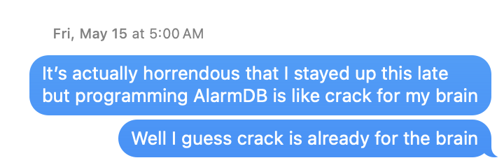

## Appendix

### How do I install NyQL?

I have no idea why you would, but if your heart so desires, you can find instructions in the [install section of the GitHub repo](https://github.com/marcos-acosta/alarmdb#installing-alarmdb).

### How are `NULL`s represented?

They're not (lol).

### LLM usage

The most interesting / fun parts of this project for me were designing the encoding/decoding scheme, choosing the right abstraction layers between the various components, and writing the Shortcuts, so those parts were done by hand. I wasn't as interested in writing the grammar for the AST or implementing the query engine, so I left those parts to Claude.

[^1]: The alarm sound doesn't seem to be readable or writable from Shortcuts.
[^2]: It just felt poetic that the Lord's Day would be set aside in accordance with the scripture: "Six days you shall store data, but the seventh day is a sacrifice to TIM COOK your God. On it you shall not carry any data." (Exodus 20:9-10)
[^3]: As I write this months after creating NyQL, I'm suddenly struck by a much more obvious solution: Shortcuts supports searching for alarms by hour and minute, which would have completely eliminated the need to track alarm indices. Smh.
[^4]: I just realized that this will break if the user puts a pipe in the field name, but that could be fixed with a better delimiter or encoding the schema names with alarms.