In October last year, I was talking with my friend Jiadai about [tactics for avoiding rick rolls](https://www.youtube.com/watch?v=dQw4w9WgXcQ), like learning to recognize the distinctive `XcQ` in the canonical Rick Roll YouTube video: `https://www.youtube.com/watch?v=dQw4w9WgXcQ`. Since we had been talking about QR codes recently,[^1] I started thinking about the practicality of recognizing rick roll QR codes by sight alone.

In a moment of overconfidence, I claimed that by the end of January 2026, I'd be able to tell rick roll QR codes from safe ones, without a scanner, with 95% accuracy. The loser would have to listen to Rick Astley's ["Never Gonna Give You Up"](https://www.youtube.com/watch?v=1VEogQzZ93U) on repeat for three hours. Jiadai recorded a voice memo of me saying this, and the bet was on.

## Formalizing the bet

At the start of January, I realized we needed to formalize the rules. Recognizing _any_ rick roll was clearly impossible — there are probably hundreds of rick roll YouTube links, not to mention literally infinite possible redirects. But memorizing a _single_ QR code would obviously be too easy. I wanted the terms to stay close to the _spirit_ of my original claim while still being at least remotely doable. Here's what I landed on for the specs of a "valid" rick roll QR code:

- Any one of the three top rick roll YouTube URLs ([1](https://www.youtube.com/watch?v=dQw4w9WgXcQ), [2](https://www.youtube.com/watch?v=xvFZjo5PgG0), [3](https://www.youtube.com/watch?v=iik25wqIuFo))
- Uppercase or lowercase domain (i.e. WWW.YOUTUBE.COM or www.youtube.com)
- Low or medium error correction (more on this later)
- Any one of the eight possible mask patterns (more on this later)

In all, that's 96 possible rick roll QR codes. By design, it wouldn't be possible for me to just commit them all to memory.

For the safe QR codes, I decided it would be most fun if Jiadai supplied them herself, so I wouldn't know what to expect at trial time. The only parameters were:

- Must be a valid, openable HTTP link
- Must be either version 3 (29x29) or version 4 (33x33)
  - Why? All 96 rick roll QR codes are one of these two sizes, so otherwise it would be a dead giveaway

The quiz would be 20 rounds, each with a 50/50 chance of a rick roll or safe QR code, and I'd need to get 19 of them right.

[How hard could it be?](https://www.youtube.com/watch?v=dQw4w9WgXcQ)

## How QR codes work

Now that the terms were set, it was time to get to work.[^2] First up: actually learning how QR codes store data. A few resources I found helpful:

* [Calvin](https://calvin.sh/)'s [Control Freak QR Code Generator](https://calvin.sh/tools/qr/)
* [Thonky's QR Code Tutorial](https://www.thonky.com/qr-code-tutorial/)
* The [QRazyBox help page](https://merri.cx/qrazybox/help/getting-started/about-qr-code.html)
* Veritasium's video on [how to encode a QR code by hand](https://www.youtube.com/watch?v=w5ebcowAJD8)
* This video [Omar](https://omar.website/) sent me of a guy 12 years ago explaining [how to decode a QR code by hand](https://www.youtube.com/watch?v=KA8hDldvfv0)

There are a lot of details, so we'll just cover the basics.

### The anatomy of a QR code

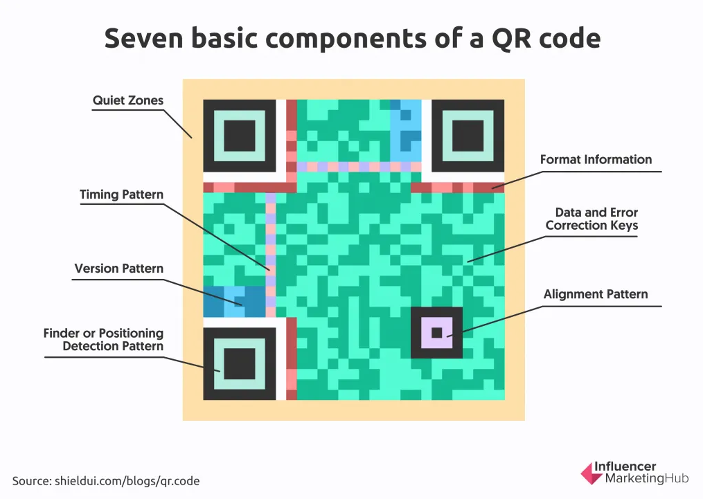

The _finder patterns_ are the most distinctive part. Scanners use these to, well, _find_ the QR code and establish its boundaries.

The QR code above is 29x29 pixels (or _modules_), also called a _version 3_ QR code. Smaller versions go down to version 1 (21x21); larger ones go up to version 40 (177x177).

All versions except version 1 have one or more _alignment patterns_, which help the scanner account for perspective warp.

Along the top and left edges are the _timing patterns_: alternating on/off modules that tell the scanner the QR code's dimensions.

Finally, the _format information_ tells the scanner about the error correction level and mask pattern. More on those in a second.

### From URL to QR code

Let's say we generate a QR code from the canonical rick roll link, `https://www.youtube.com/watch?v=dQw4w9WgXcQ`.

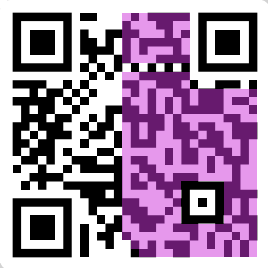

The purple highlighted part is the URL itself (visual courtesy of [Calvin](https://calvin.sh/tools/qr)). Each letter gets converted to its byte representation (one letter = 8 bits), and those bytes snake[^5] up and down starting from the bottom right corner. Here, white = bit off (`0`) and black = bit on (`1`). Notice how the data skips over the fixed parts of the QR code, like the alignment pattern, format information, and timing pattern.

#### Error correction

You might also notice that the URL only takes up half the QR code. What's the other half? Part of it is padding, but the rest is _error correction_.

Error correction is implemented using [Reed-Solomon error correction](https://www.youtube.com/watch?v=dQw4w9WgXcQ), which I won't pretend to fully understand, but the gist is that it adds redundancy so that if parts of the QR code are covered, missing, or scanned wrong, it can still be read. There are four levels, depending on how much damage you want it to tolerate:

- `L`: Low  (scannable with 7% of QR code damaged)
- `M`: Medium (15%)
- `Q`: Quartile (25%)
- `H`: High (30%)

The error correction level is stored in the format information, in the first two modules just below the top-left finder pattern. In this QR code, both are on (`11`).

- `11` means low (`L`) error correction
- `10` means medium (`M`) error correction
- `01` means quartile (`Q`) error correction
- `00` means high (`H`) error correction

Lastly, there's one very big catch.

#### Mask patterns

If you actually converted the URL to binary and compared it to the QR code, they wouldn't match. Naively encoding bytes as-is would create large patches of black or white, which makes it hard for scanners to read. To fix this, one of eight _mask patterns_ is used to deterministically _flip_ certain modules from on to off and vice versa. Check out this diagram from the [QRazyBox help page](https://merri.cx/qrazybox/help/getting-started/about-qr-code.html):

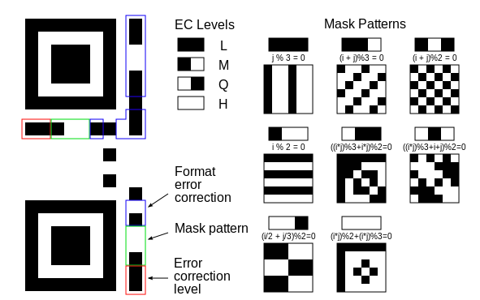

The first mask pattern you see there flips every third column, the fourth one flips every other row, and others get crazier with it. In practice, the QR code generator tries all eight and picks whichever results in the least clumpiness.

The QR code encodes which mask pattern was used in the format information, right next to the error correction level. When decoding a QR code, the scanner re-flips the appropriate modules to recover the original bytes.

## Idea #1: Just read the damn thing

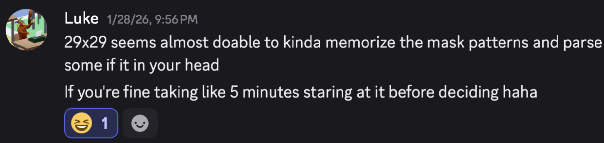

Since half the QR code is error correction anyway, my first idea was to just read the data bytes in my head. That would be slow,[^3] so I'd only read a select few, like maybe the `u` in `youtube` and a couple characters of the video ID. Sure, I might get unlucky if Jiadai picked a URL that closely resembled a rick roll, but I figured there wasn't much I could do about that anyway. How hard could _that_ be?

Well... very hard. The problem, it turns out, is the mask pattern. It's one of those classic time-space tradeoffs. I could go the space-efficient route (run the mental math to figure out which modules to flip, then convert to ASCII in my head) but that would be way too compute-heavy, and my brain is low on RAM. The alternative would be to memorize all eight versions of each byte of interest, one per mask, which is only slightly better than just memorizing 96 QR codes.

I gave up on this idea before I even started.

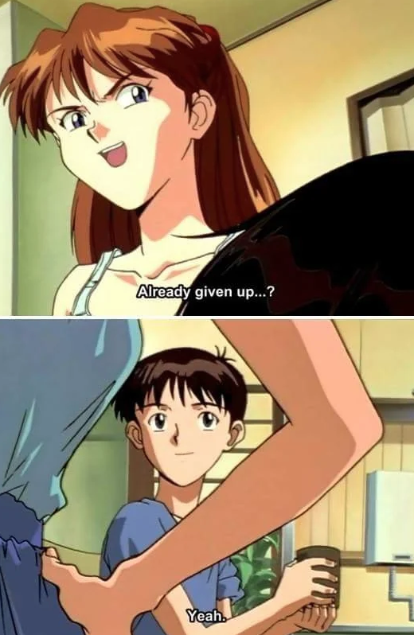

## Idea #2: Bits with high mutual information

So my first idea was dead, but there was still one useful observation buried in it: not all parts of a QR code carry equal information. For example, the finder patterns, alignment pattern, and timing patterns all carry zero information from a rick roll perspective. Other modules carry more information, presumably to differing degrees.

So, I tried plotting a heatmap of the [_mutual information_](https://www.youtube.com/watch?v=xvFZjo5PgG0) of each module. Mutual information (also called _information gain_) measures how much you learn about one variable by observing another. In this case, it measures how much knowing a module's state tells you about whether the QR code is a rick roll.[^4]

Before any of that, though, I needed labeled data. For positive examples, I just repeatedly sampled from the 96 rick roll QR codes. For negative examples, I started by generating QR codes from random safe YouTube links or gibberish URLs. I generated a few thousand of each, separated them by version, and ran the calculation.

Here's what I saw for version 3 (29x29) using the "gibberish" algorithm for the negative examples:

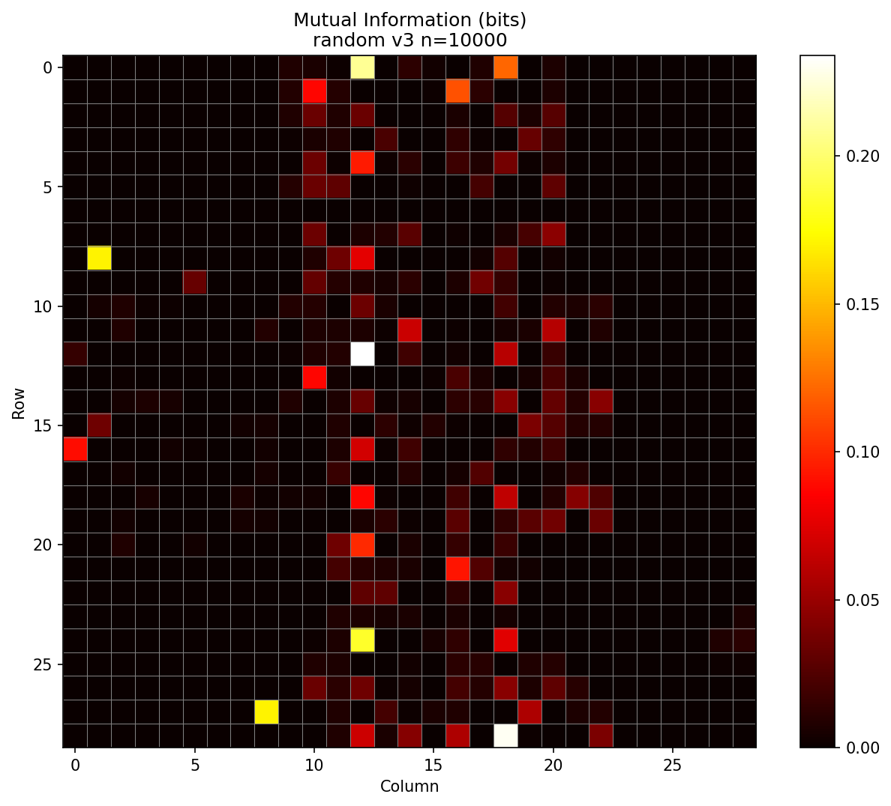

At first, I was excited — the finder and timing patterns had zero information, as expected. But then I spotted that yellow pixel in the top left. Why was one of the most information-dense modules the one that distinguishes low from medium error correction?

_\*facepalm\*_

It turned out that _all_ the rick roll QR codes with low error correction were version 3. Similarly, all medium error correction rick roll QR codes were version 4, because the additional error correction simply doesn't fit in the 29x29 grid. But some gibberish URLs were short enough to fit in version 3 _with_ medium error correction, meaning a single pixel in the format information would be a dead giveaway.

To fix that issue, I required all version 3 safe QR codes to use low error correction, and all version 4 to use medium. I also made a mental note that if I ever saw a different combination during the trial, I'd immediately know it wasn't a rick roll.

Once I made those changes, the mutual information map looked less suspicious (also note the maximums are a more moderate ~0.08 bits versus ~0.2 bits):

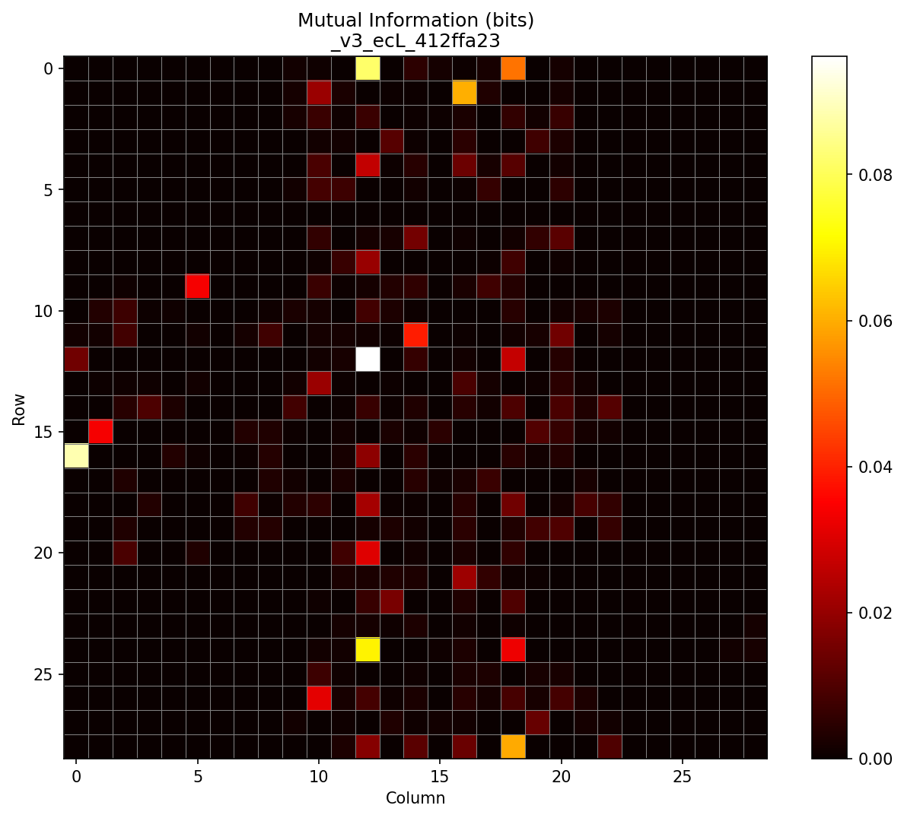

There are still curious patterns worth investigating, like why so many information-dense modules line up vertically, why they seem to come in distinct columns, but I'll leave those as an exercise for the reader. I was running out of time and couldn't afford another rabbit hole.

So, how was I supposed to take this information map and turn it into a classifier?

My first thought was to check the `N` most information-dense modules and have each one "vote" based on whether its on/off state was more associated with rick rolls or safe QR codes. I tried it, but even as I increased `N`, accuracy barely crept above 80%.

In hindsight, that was predictable. For one, different modules carry different _amounts_ of information and should be weighted accordingly. Then again, that wouldn't be an option at trial time, because my capacity for mental math is also sub-par. Today at work, somebody asked what was 30 divided by 4 and I confidently said 15.

There was another issue, though: since we're looking at multiple modules, individual votes don't make sense. For instance, one module being on might only predict a rick roll _if_ another module is off. In other words, we need to consider _joint_ probabilities.

## Idea #3: Decision trees

See, it was clear that certain combinations of modules being on or off would be indicative of the QR code's rick roll-iness. In the extreme case, the "combination" of _every_ module in the QR code is a perfect predictor. It seemed reasonable that there would be _smaller_ combinations that are also very predictive.

Since there are so few distinct "valid" rick roll QR codes compared to the infinite alternatives, it's almost certain that by random chance, there'll be some combinations of off/on modules that appear in many rick roll QR codes but are statistically unlikely among randomly chosen safe QR codes.

That said, this all depended on the quality of the algorithm I used to generate safe QR codes, since my opponent Jiadai could choose _any_ QR code that produced a valid HTTP URL. As an example, let's say that the safe QR codes in my training data had an implicit bias which resulted in a certain error correction module usually being off. If this helped distinguish between the two classes during training, my model would learn to pay attention to this module being off. But maybe Jiadai ended up choosing URLs from a certain domain which, due to some mathematical coincidence, typically resulted in that same error correction module being _on_. Then, my whole plan would fall apart.

So, I made the safe QR code algorithm more robust by having the generator randomly choose from a few different "types" of URLs that I hoped would better match Jiadai's distribution.
- Random safe YouTube URL (50% chance)
- Random gibberish URL (25% chance)
- "Evil" YouTube URL (25% chance)
  - i.e. only one character away from a rick roll YouTube URL

With the data quality improved, all that was left was to choose the machine learning algorithm.

> ChatGPT? LLMs? AI slop? What are you talking about? It's 2013, let's put on some Imagine Dragons and train some decision trees!

That's right, we're doing some old school machine learning.

Decision trees were a natural fit because they're basically just data-generated flowcharts. At trial time, I wouldn't need to do any difficult mental calculation. I'd just run through a series of yes/no questions like "is the module at (X, Y) on?" and follow the branches until I hit a leaf node. I mean, sure, I could also train a small neural net to accomplish the same task, but sadly, the gazillion-parameter organic neural network in my skull is incapable of emulating even a tiny artificial neural network.

So, I split my data into two buckets, version 3 and version 4, and converted all the QR codes to vectors by concatenating their rows and representing them numerically. In other words, a single version 3 QR code became an 841-dimensional vector, and a version 4 QR code became a 1,089-dimensional vector. Then I just trained a decision tree for each version using good ol' `sklearn`, and that was that. The only question was: would it be good enough?

Initially, the answer was no.

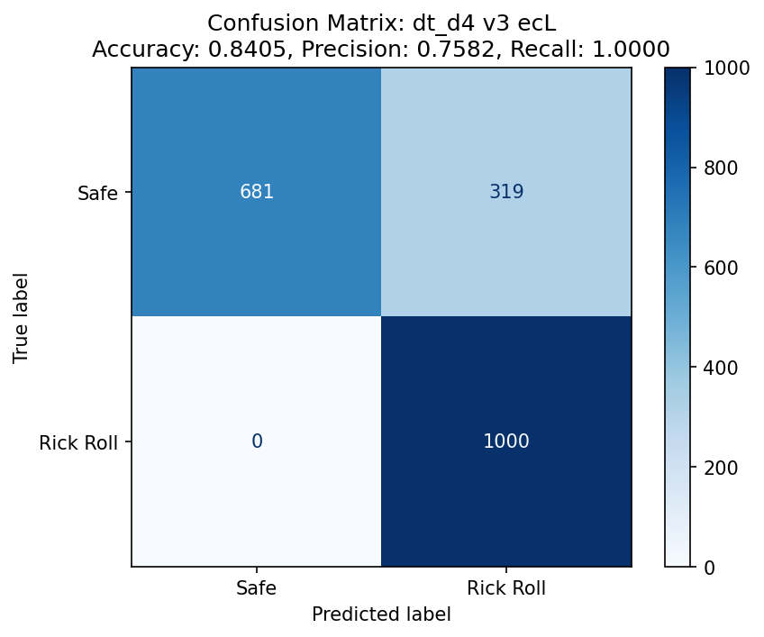

Above is the confusion matrix for a decision tree trained on the version 3 (29x29) QR codes. The accuracy is only 84%, which is so close yet so far from 95%. I was surprised to see that the recall was 100%, and at first, I figured this must be another instance of data leakage in the training data. But then I realized this was expected: since all the positive examples only come from a handful of unique examples, the model can easily memorize patterns and eliminate the possibility of a false positive.

Still, that 84% accuracy. But there was hope! I had set the maximum depth of the tree (i.e. the maximum number of "decision points" in the flow chart) to `4`, because, well... I needed to memorize two of them, and my memory's not that great. But if I wanted to win (and make no mistake: I did), I would simply have to push my limits. I increased the maximum depth to `5`, and then `6`. It wasn't until I bumped the maximum depth to `7` that I got some models that could _maybe_ do the trick.

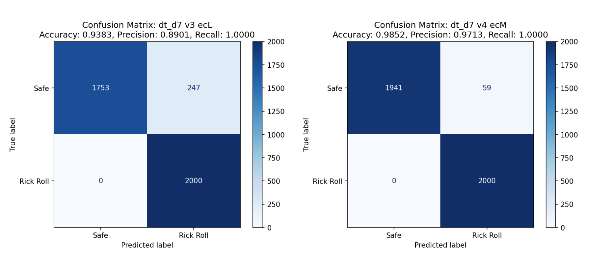

The one on the left is for version 3 (29x29), the the one on the right is for version 4 (33x33). You might notice that the accuracy of the version 3 model is less than 95%. However, I didn't see myself memorizing two decision trees with depths larger than 7, so this was my best bet: if I assumed that the two versions appeared roughly equally, and I emulated the models in my head perfectly, I would average out to an accuracy of... 95.48%.

Talk about a fair game.

### Memorizing two depth-7 decision trees

The hard part was over! Now I just needed to print out the trees with `sklearn`'s built-in visualization module and commit them to memory:

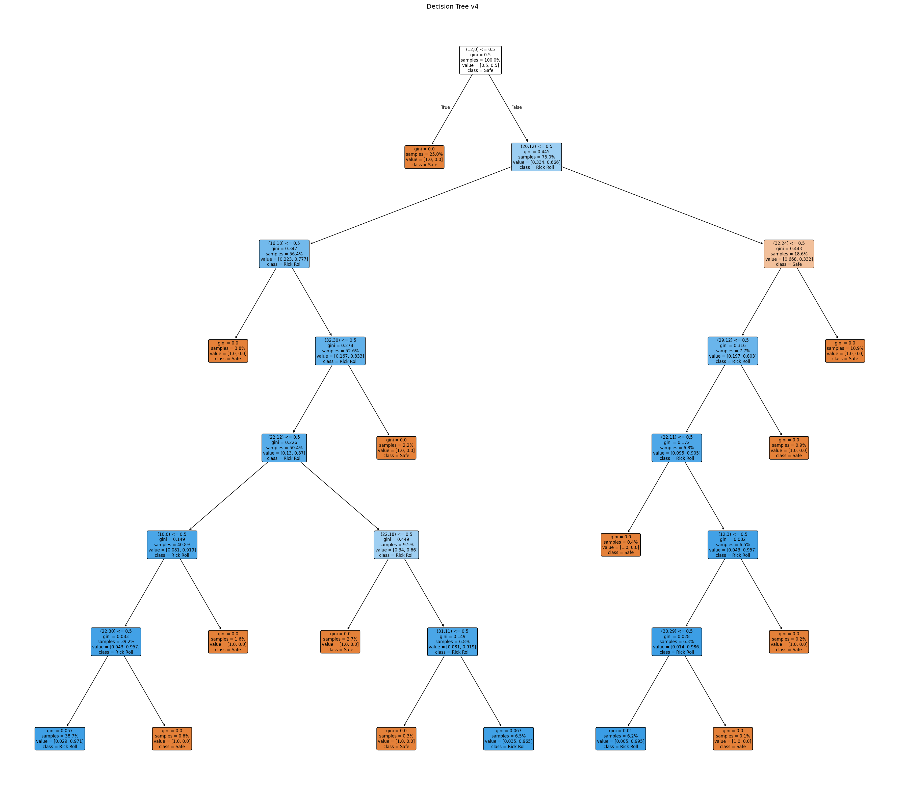

Yeah, that's not happening. I'd have better luck memorizing the entire `curl` manpage. I needed something way more _visual_. Conflicted as I often am about vibecoding, I was more than happy to kick Claude Code into `Auto-Accept Mode` and turn that eyesore into a glamorous study guide:

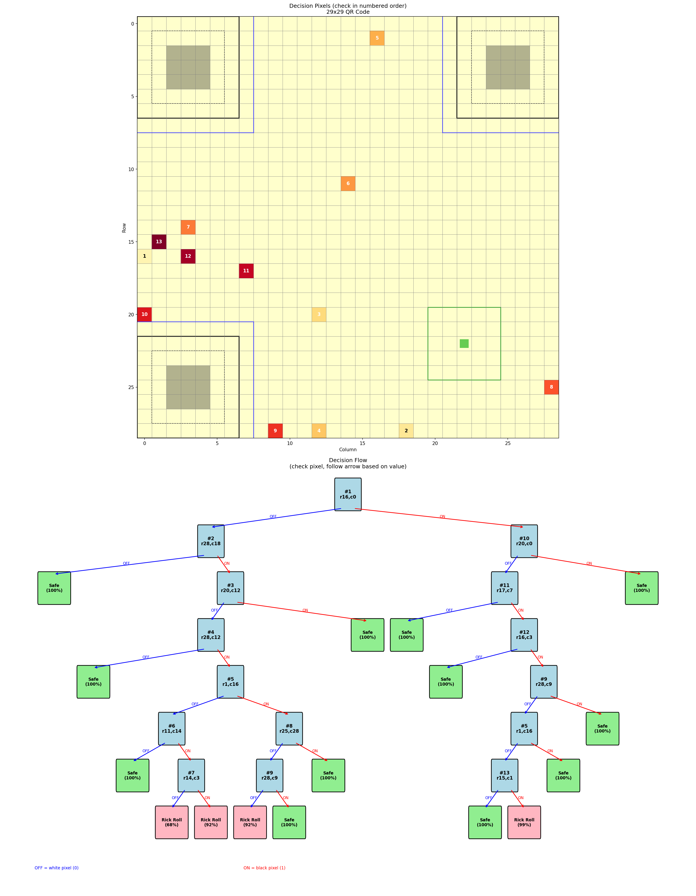

I had one for each tree (i.e. each version of QR code). Each "key module" was numbered on both the grid and in the decision tree so that I could easily cross-reference.

I could also tell from the tree structure that the models clearly _did_ memorize parts of the rick roll QR codes. In the tree shown above, there are only three combinations that result in a rick roll prediction. If the QR code doesn't have one of those patterns, it's assumed to be safe. After seeing the confusion matrices, this made sense!

### Drilling

For a while, I just stared at the study guides for the two versions and quizzed myself in my head, but eventually I knew I had to test myself more rigorously. I once again leaned on Claude to cook up a CLI where I could test myself against the same safe QR code generator I used for training. I also added an option to constrain the QR code generation to require certain modules be on or off, which helped me practice less-common branches of the decision tree.

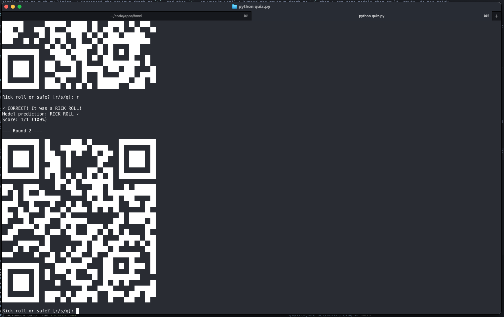

After a couple days of focused drilling, I was as ready as I'd ever be.

## The trial

The trial itself took place at CCNYC, a creative coding meetup I help organize. Oops, I dropped a [link](https://ccnyc.space/). Ah, sorry, dropped [another link](https://www.instagram.com/creativecodingnyc/), my bad.

Earlier,[^6] I made a website that would serve as the official arbiter of justice, hosted at [rickroll.marcos.ac](https://rickroll.marcos.ac) and designed by Jiadai. It was designed so that Jiadai could drop in a JSON file of her chosen safe URLs ([example JSON format](https://github.com/marcos-acosta/rick-roll-qr-codes/blob/main/example-json/non-rick-rolls.json)) and the site would take care of the rest. I used a Kahoot-style setup where one screen is the host and I, as the player, join with my phone. The mobile site uses the camera so that if I choose to scan the QR code, the backend server gets notified via WebSocket. Accidentally scanning a rick roll QR code results, obviously, in the dreaded song playing.

We could have just generated the 20 QR codes as images and called it a day, but as the great Megamind once said...

> _PRESENTATION!_  
> – Megamind

The first QR code was the most nerve-wracking. After all this analysis, memorization, and training, two mistakes is all it would take to lose the bet. In the best case, my training data _was_ representative of Jiadai's safe QR codes, I perfectly emulate the decision trees, and the model is only wrong at most once. On the other hand, even with perfect play, the model could easily be wrong twice, and that's _if_ my training data was any good. The first QR code was my litmus test.

But I trusted the process, followed the decision tree, and didn't scan it.

Breath of relief. I kept going. On the second QR code, I took one look, decided it was safe, and scanned it. Disaster followed.

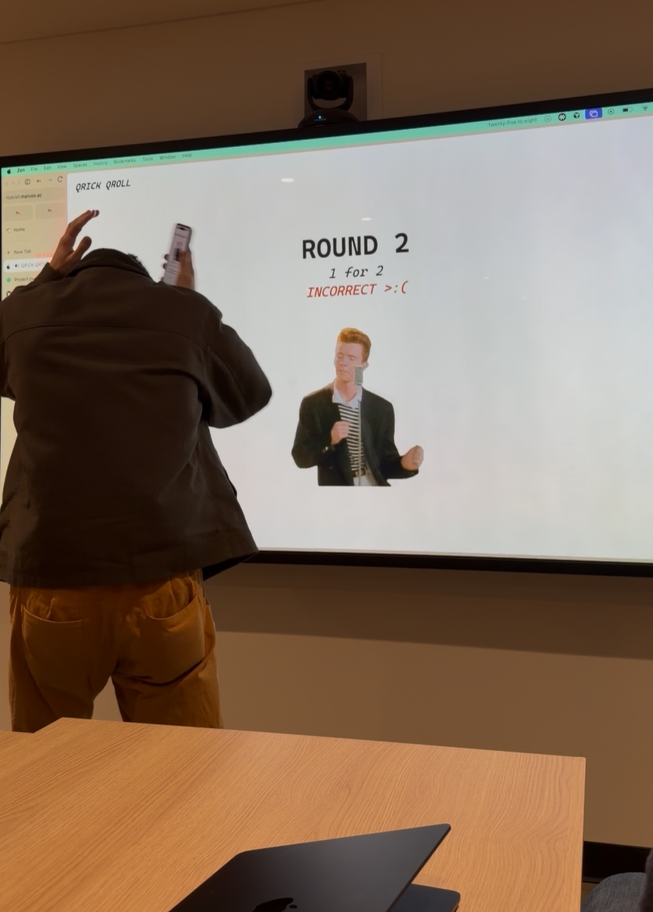

What had happened is that I saw the first two modules in the format information were on, which– in a moment of nerves– I mistakenly thought meant `MEDIUM` error correction. Since the QR code was version 3 and all version 3 rick rolls had `LOW` error correction, I deduced it must be safe.

This was a critical blunder. Now, not only did I need to refrain from making a single mistake, my decision trees would _also_ need to be perfectly accurate, which was never a guarantee in the first place. But there was no other choice than to roll with the punches and keep going. I got the next round right, and the one after that too.

As the rounds went by, I started to loosen up and entered the QR code scanning zone. I reached round 10 without making any additional mistakes.

By round 15, [Maxime](https://maximeheckel.com/) noted: "He does it faster than I can whip out my camera."

Finally, the last[^7] round. It was a version 3 QR code and the first two modules of the format information were `on off`. This time, I knew what `MEDIUM` error correction looked like. I scanned the QR code and cemented my victory.

## Epilogue

So... I won the most _interesting_ part of the bet, but the _exact terms_ said I'd do it by end of January, and I had postponed to mid-February because I wasn't quite ready yet. Thankfully, Jiadai accepted a compromise: she'd listen to two hours, and I'd listen to one. Here's a picture of us being tortured together.

We also took the opportunity to finish implementing Jiadai's design for the site. At trial time, I had to roll back to my (boring) minimalist design because I found the QR codes hard to read and I couldn't tell if the scanning was working. So, we fixed some UI bugs and the site looks much spiffier now thanks to her.

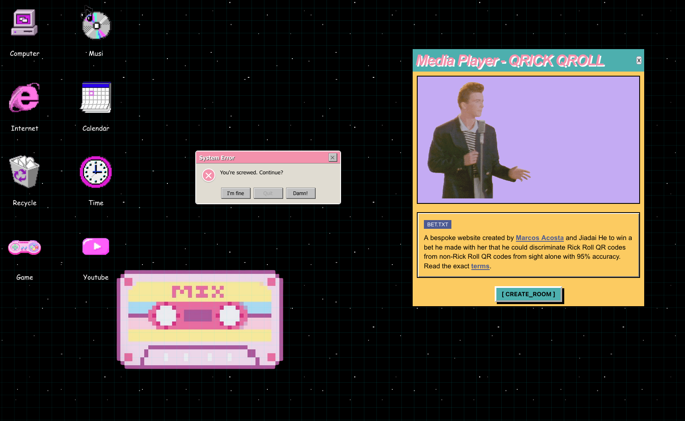

RIP Jiadai's Spotify recommendation algorithm, though.

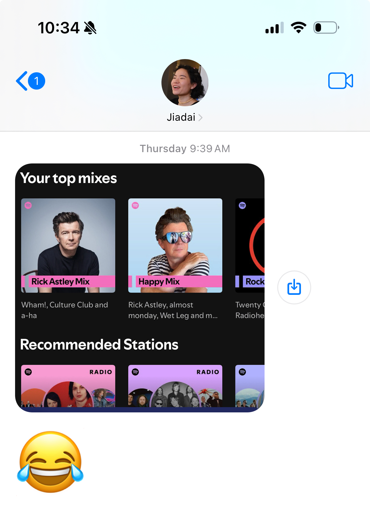

[^1]: I feel like talking about QR codes is kind of like talking about sports teams but for nerds.
[^2]: Well, actually, it was time to procrastinate on this project until the very end of the bet period, but let's breeze through that part.
[^5]: This is a huge oversimplification. Trust me.
[^3]: Although time limits were never mentioned in the original terms of the bet, not even I wanted to spend 10 minutes reading a QR code.
[^4]: Mutual information is similar to correlation, but also not- one big difference is that correlation assumes that the relationship between the two variables is linear, while mutual information doesn't even assume it's a continuous function.
[^6]: In fact, I made the website before I even started figuring out how the hell I was going to win this bet, and used the web development as an excuse to procrastinate on doing that.
[^7]: For those keeping score, the reason it says "ROUND 19" is because my device got booted from the WebSocket connection after the first round, so we had to restart.
