_Try it yourself! [rugb.app](https://rugb.app)_

### The context

It started when a friend showed me [this video](https://www.youtube.com/shorts/W4Rebo3aEkY) of Tom Lum guessing the RGB value of his friend's nail color with astonishing accuracy. _Now this_, I thought, _is a useless skill worth having_. I searched the web for a site where I could practice guessing RGB values in a gamified way but didn't find anything. So, as is always the case when a nerd can't find the exact thing they want, I decided to make it.

### Game design

Even with such a simple premise, it wasn't immediately clear to me how the game mechanic should be framed from a game design perspective. At the time (the year of our Lord 2022), Wordle had been out for a year but was still _the_ minimalist web game, so the "Wordle treatment" was very tempting. In that approach, the player would be shown a color and given _N_ guesses to  guess the exact RGB (or hex) values. Although very zeitgeist-y, I felt like the fun in guessing color codes was just getting good at being in the ballpark, not mechanically trial-and-error-ing to find the exact right values.

With that in mind, [Geoguessr](https://www.geoguessr.com/) actually seemed like a better game design reference. Multiple rounds, each one randomly selected, one guess each, and a final cumulative score at the end.

From the start, having a smooth and enjoyable UX was a priority. Since the game has only one mechanic (i.e. input numbers and submit), I figured it should be done well. I went with a minimalist approach where the target color is shown in the background and the RGB input is the central element. I also added a few convenience features, like automatically tabbing to the next value input after typing a 3-digit number (since RGB values can't exceed 255) and auto-selecting an invalid RGB value. On submission, the predicted color is shown directly above the target color to give the player crucial visual feedback.

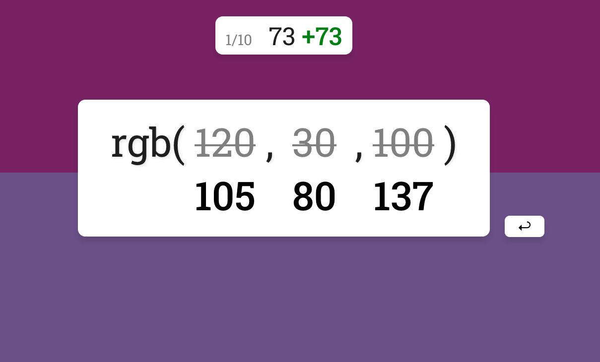

Finally, in Geoguessr-esque style, I added a summary page so the user could see how they performed across all ten rounds at a glance.

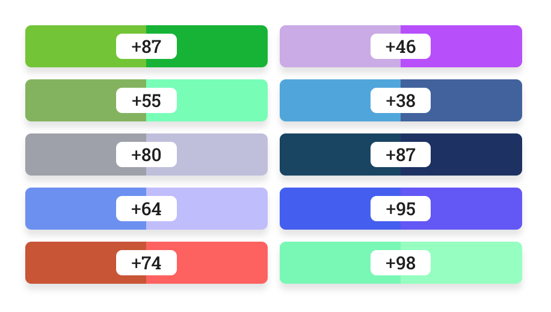

### The color theory rabbit hole

By far and away, the most intricate part of this project was settling on a fair scoring function. In Geoguessr, the primary metric is distance and an exponential curve is applied. The exponential has a nice effect: guessing 1 mile closer to the target matters much more when you're, say, 5 miles from the target than it would if you were a thousand miles away.

The most obvious way to apply this to the color-guessing equivalent would be to treat the RGB values as a 3D space (imagine a cube with each axis representing red, green, and blue), so then the "distance" between a predicted and actual color would simply be the [Euclidian distance](https://en.wikipedia.org/wiki/Euclidean_distance) between the two. Similarly to Geoguessr, I also applied an exponential to make accuracy more important the closer your guess is to the actual color.

```js
distance = sqrt(
  (r_actual - r_pred)^2 +
  (g_actual - g_pred)^2 +
  (b_actual - b_pred)^2)
score = round(max(0, 100 - (distance / A)^B))
```

Where `A` and `B` could be tuned until it "feels right".

But as I began testing, I noticed that something was off. A guess that looked spot-on would sometimes get a *worse* score than a clearly mediocre guess. At first, I figured it was just my imagination. But on one occasion when I guessed a shade of green that was (in my estimation) indistinguishable from the target color and received a sub-par score, I knew there was definitely a problem. This was the beginning of my descent into the deep, deep rabbit hole of color theory. Cue the obligatory [xkcd](https://xkcd.com/1882/):


The main problem is that the RGB color space isn't perceptually uniform. To see what I mean, take a look at the pairs of colors below.

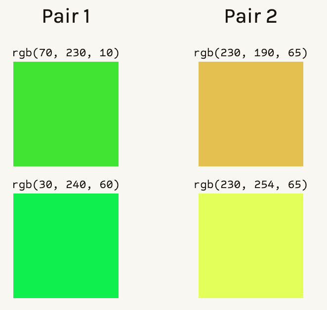

If your eyes are anything like mine, the pair of greens on the left look extremely similar, while the colors on the right are obviously different. The two shades of green are `sqrt(40^2 + 10^2 + 50^2) = ~64.8` units apart in RGB color space, assuming a Euclidean geometry. The pair of colors on the right are, surprisingly enough, _also_ 64 units apart! Clearly, Euclidean distance in the RGB color space doesn't align with our perception of color difference.

Solving this alignment problem is hard, but luckily, I'm far from the first person to confront it. Enter: the [International Committee on Illumination (CIE)](https://en.wikipedia.org/wiki/International_Commission_on_Illumination), which formed in 1913 to become the authority on matters of light, illumination, color, and color spaces. One of the CIE's lasting contributions is the [CIELAB](https://en.wikipedia.org/wiki/CIELAB_color_space) color space, or LAB for short.[^3] Like RGB, LAB uses three values to represent color. But instead of amounts of red, green, and blue, LAB uses `L` to represent lightness, `a` to represent the amount of red/green, and `b` to represent the amount of blue/yellow. In 1976, the CIE began tackling the question of quantitatively measuring color difference. They proposed a metric called [∆E*](https://en.wikipedia.org/wiki/Color_difference#CIELAB_%CE%94E*), which should have the following properties:

- `∆E* < 1.0`: No perceptible difference
- `∆E* = 1.0`: Just noticeable difference (JND)
- `1 < ∆E* ≤ 2`: Perceptible difference with close observation
- `2 < ∆E* ≤ 10`: Perceptible difference at a glance
- `∆E* < 50`: The two colors are more similar than they are different
- `∆E* = 100`: The colors are opposites

The first color difference function the CIE cooked up in 1976 (called dE76) is actually our old friend Euclidean distance, but in the LAB color space instead of the RGB color space.

```js
dE76 = sqrt(
  (L_actual - L_pred)^2 +
  (a_actual - a_pred)^2 +
  (b_actual - b_pred)^2)
```

While LAB is generally _more_ perceptually uniform than RGB, it's still not perfect. Just take a look at the pairs of colors below:

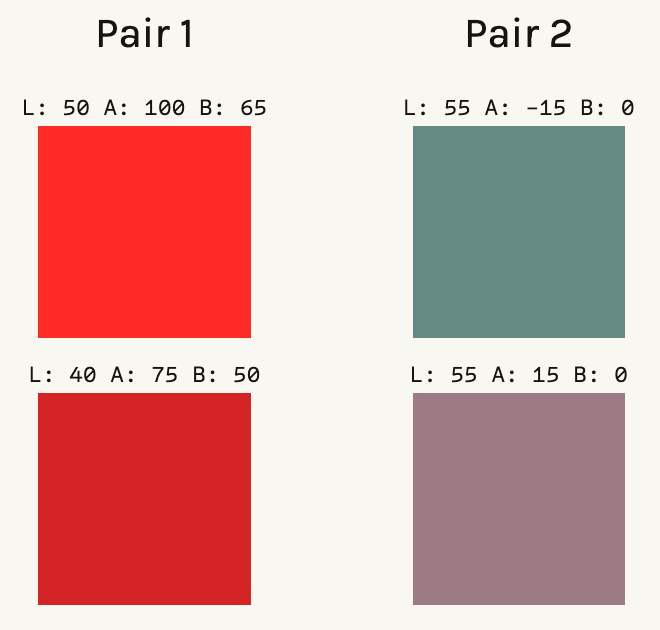

dE76 puts both pairs of colors at `∆E* = 30`, even though the pair on the left are just slightly different shades of red while the pair on the right are straight-up different colors.

In the coming decades, the CIE iterated on their color difference formula, giving rise to dE94 in '94 and dE00 in 2000, each of which improved on its predecessor in terms of aligning the ∆E* metric with its intended interpretation. Taking a glance at the equation for dE00, we see that the Euclidean simplicity of dE76 has been overhauled with some hardcore feature engineering:

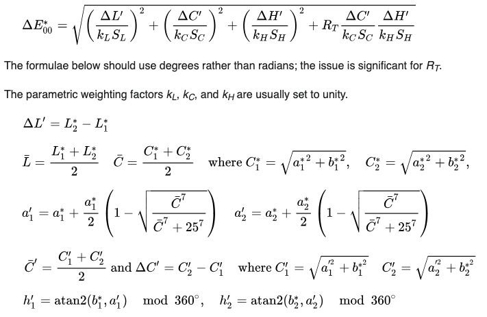

When I swapped out my RGB-based Euclidean distance with LAB-based dE00 function, I found that the scores were much more reasonable.

With the scoring function fixed, the only thing left to do was to pick a name. I settled on RUGB because it almost spells RGB and has absolutely nothing to do with rugby.

### The brief RUGB scene at Harvey Mudd College

Once the site went live, it started to spread among my friends, and then to their friends as people raced to the top of the leaderboard. This brought me a lot of joy– arguably, a game designer's one hope is that players enjoy the experience of playing it. 

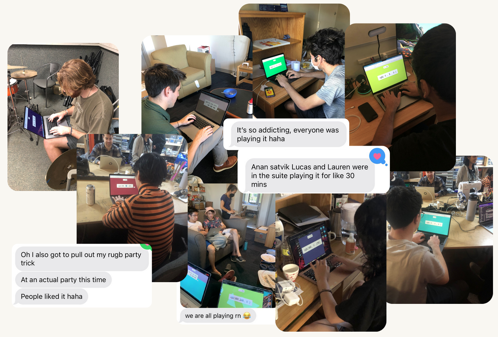

Since there are ten rounds with a maximum 100 points per round, the maximum theoretical score is 1,000. Within a day, the leaderboard was filled with scores in the 800s. One of our [beloved CS professors](https://www.ratemyprofessors.com/professor/144363) managed to top the leaderboard in one try with a score of 870.

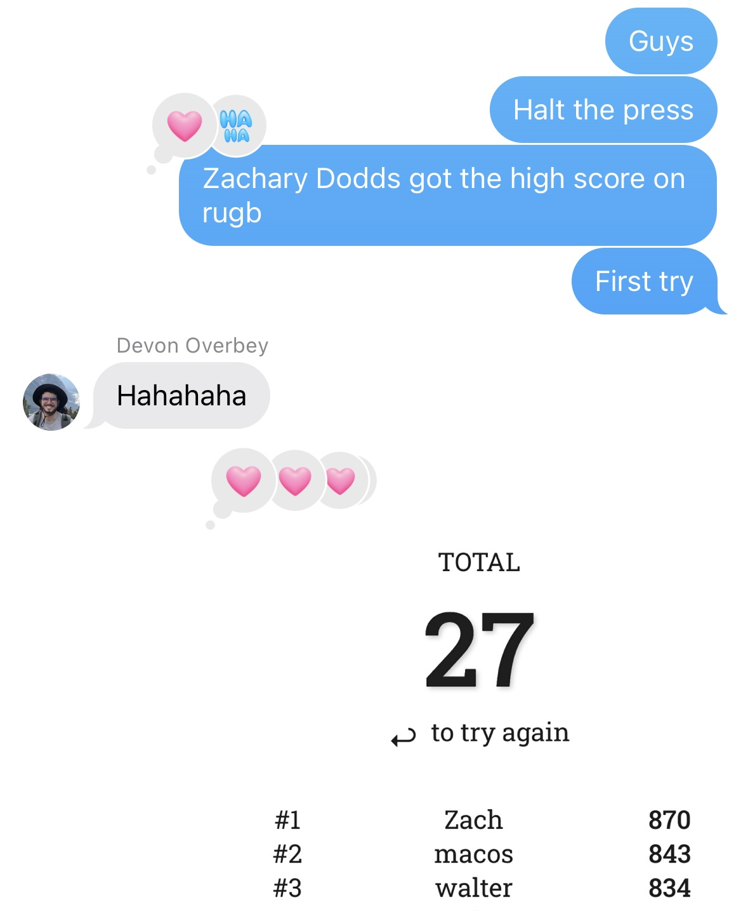

By the next day, the bar had been raised to 939, averaging an impressive 93.9 points per round. As the leaderboard became more cutthroat, I noticed that players intent on making the leaderboard would simply refresh the page after making a particularly bad guess to avoid wasting time on a bad run. It also highlighted an interesting fact of RGB guessing: certain colors *are* easier to identify than others (we learned that shades of yellow/brown were particularly difficult), so part of the strategy for getting a high score was just playing enough times for the RNG to produce an "easy" run.

As time went on, the top scores continued to creep higher into the 900s. By the time I graduated, the high score was an astounding 946, and I was no longer on the leaderboard, which to me is a sign of success.

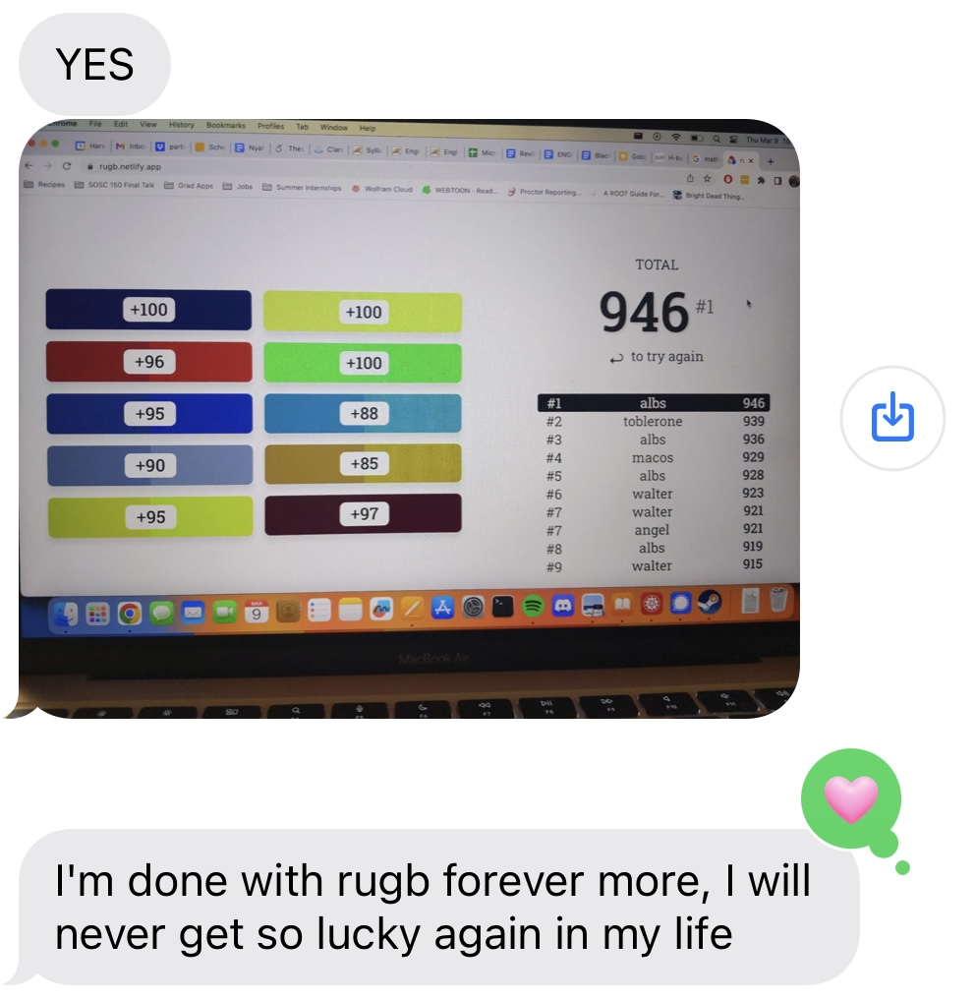

### Reflection

Looking back a few years later, making RUGB and watching its brief moment in the spotlight on campus was a highlight of the semester. I had made a few other games at that point, but (to the surprise of no one) it was especially rewarding to see other people get truly _involved_ with a game I made.

At the time, I had a number of ideas for how I world improve RUGB. For one, there was the low-hanging fruit of making the page less narrow-screen-hostile. Shown below is an image of a displeased user.

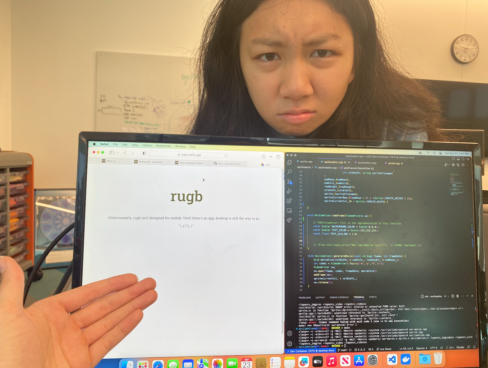

For another, there was the handling of cheaters: it's hilariously easy to cheat on RUGB, since the answer is literally in your browser.

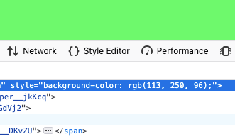

Case in point: I checked the leaderboard today and noticed that somebody has generously self-identified themself as a cheater.[^1]

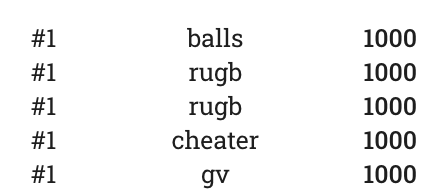

Practically, there's very little that can be done about that, since banning a perfect score seems excessive. I did, though, get a creative suggestion to catch players digging for low-hanging fruit in the browser's inspector: Apply an overlay to the background color with some opacity, and then in the application logic, calculate the resulting "combined" color and treat it as the true target color.

On the subject of over-engineering RUGB, some other ideas I had included a timed version, where the score is also a function of speed, a "color of the day" (a slight Wordle-ification), "RUGB for dogs" that excludes reds and greens (also helpful for colorblind folks), and a "versus mode" where players would go head-to-head with a random challenger, [QuizUp](https://en.wikipedia.org/wiki/QuizUp)-style. There were other things, too: I never got around to making the site mobile-friendly, and I meant to add better analytics so I had proper usage data beyond just the scores themselves.

I slated these ideas for later, since I still need to graduate, and my head was filled with other projects I wanted to work on. Plus, it seemed like RUGB had gotten all the attention that a color-guessing game could get.

#### On "almost making it"

About a year later, I was telling a friend about RUGB. To my surprise, he seemed to already be familiar with it. He showed me this fellow named [Jared Cross](https://www.instagram.com/jared__cross) who found his niche as a color guessing expert. But Jared wasn't on RUGB; he used a hex-guessing site called [Hexcodle](https://hexcodle.com/) which was published a year after RUGB. The very next day, a different friend sent me a link to *another* recent hex-guessing game which was generating a lot of buzz online[^2]. I couldn't help beating myself up for not implementing the ideas I had, and for not attempting to share my work online. _If only I had_, I thought, _I might have had my big break_.  That was the first time I felt that specific feeling; I'd never been concerned about the mythical "big break" prior to making this silly little color-guessing game.

Looking back with even *more* hindsight now, I can see that my negative reaction was overblown. Since then, I've had a small moment in the spotlight when my [CSS game](https://csshell.com/) hit the front page of Hacker News and was [live-streamed](https://www.youtube.com/watch?v=z6OQO5SwUhU) by CSS guru Kevin Powell. I noticed two things from that experience:

1. Modest internet success or the lack thereof apparently had no effect on my desire to keep making fun websites (and get better at it)
2. Watching RUGB's brief popularity on my college campus was more personally rewarding

Plus, the narrative of "I could have done that" or "I did that first" often overlooks some crucial details. As an example, people who lament not having come up with Wordle first (such a simple idea!) might not know that before Wordle, [Josh](https://www.powerlanguage.co.uk/) had already honed his craft of developing simple-yet-addictive games with the viral Reddit social experiments [r/place](https://en.wikipedia.org/wiki/R/place) and [the button](https://en.wikipedia.org/wiki/The_Button_(Reddit)).

More recently, I've seen people react negatively to Blake Anderson's sensational [Horse Race Tests](https://x.com/snakesandrews/status/1908942786549998058), bewildered by how such a seemingly simple and crude game with no direct player interaction could gain such a large following. But having seen Blake give a talk at [Wonderville](https://www.wonderville.nyc/events/wordhack-july-2024) two years earlier, I can say with absolute certainty that Blake has been honing his craft for ages, and if anything, his virality is overdue.

As another example, [Harvest Moon](https://en.wikipedia.org/wiki/Harvest_Moon_(video_game)) came out before [Stardew Valley](https://en.wikipedia.org/wiki/Stardew_Valley) and yet never saw the latter game's level of success despite being a nearly identical farm sim game. The core game mechanics might be the same, but people care about e.g. the fact that Stardew Valley allows same-sex marriage, unlike Harvest Moon. Details like that matter.

That's not to entirely discount the role of luck, though (see: Darius Kazemi's [How I Won the Lottery](https://www.youtube.com/watch?v=l_F9jxsfGCw) talk). Actually, luck is just a different way of looking at the same thing. When you have a system as chaotic as millions of individuals who may or may not see or play or share your game, it's fair to talk about randomness, although certain patterns will seem deterministic (for example, if your game can't be played on a phone, it probably won't be as popular).

Thus ends my philosophical aside. More to the point: I had a blast making RUGB and, in the process, learned to temper my own unproductive, impatient desire for broader success. Because, in the memorable words of Robin Sloan, [an app can be a home-cooked meal](https://www.robinsloan.com/notes/home-cooked-app/).

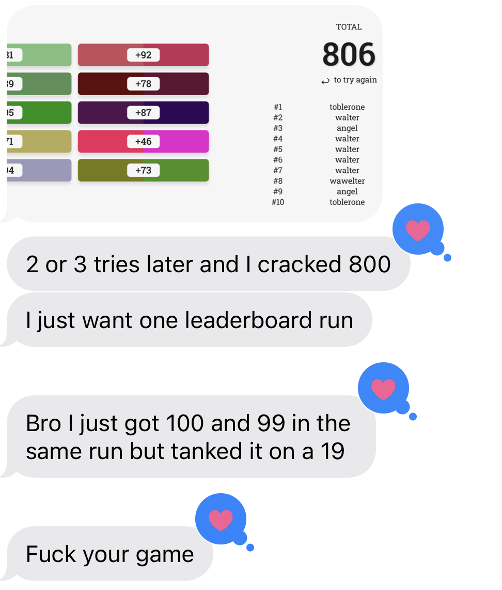

[^3]: Technically, it should be L\*a\*b\*, and it should be `L*` instead of `L`, etc., but there's no need to be pedantic here.
[^1]: To be honest, I'm not sure that any of the top 9 scores are legitimate, which would imply that albs in 10th place may still have the top legitimate score, two years later.
[^2]: It was called Colorrush by [luke](https://github.com/bvvst), but I can't find it anywhere now. Strange, because I remember it seemed very high-effort.