## How it started

Starting in April of 2025, I began showing up to [Creative Coding NYC](https://www.instagram.com/creativecodingnyc/) (CCNYC) pretty much every week. CCNYC is full of people who love to code for the hell of it, frequently (but not always) using software like [p5.js](https://p5js.org/), [three.js](https://threejs.org/), [TouchDesigner](https://derivative.ca/UserGuide/TouchDesigner), and livecoding libraries like [strudel](https://strudel.cc/) and [hydra](https://hydra.ojack.xyz/docs/). As for me, I skew more toward making web apps, but the community is so welcoming and I share so much in common with the folks there that it wasn't hard to show up every week and become a regular.

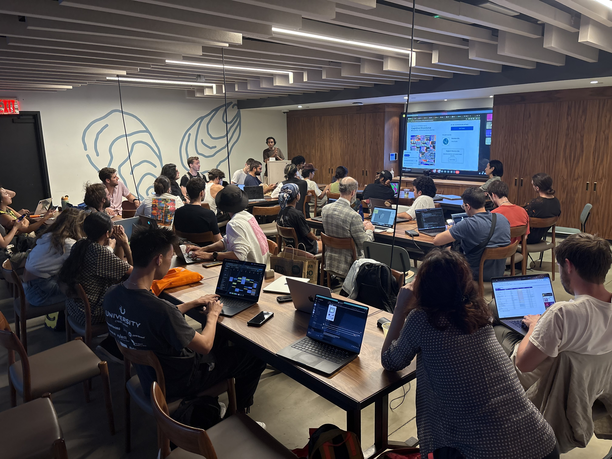

After spending all of June at [ITP camp](/blog/itp-camp-25) alongside co-organizers Sasha and Shiva, Sasha revealed that CCNYC would be turning two years old in September. Naturally, there would be a huge celebration. What Sasha wanted me to help with specifically was some sort of game-like event to kick off the celebration. It should involve creative coding, but ideally it wouldn't be "just" a hackathon.

My first decent idea was what I called the "creative code-off": as folks arrive for the party, we would randomly assign them to Team A or Team B. People could then choose to challenge anyone on the opposing team to a creative code-off, in which both players are given the same prompt and 5-10 minutes to creatively code anything within that prompt. Their screens would be projected for everyone to spectate, and then the winner would be chosen by popular vote, and the winning team gets a point. I liked this idea it would be fun for players and casual spectators alike, and because it's easy to come up with fun prompts like:

- "An unhinged subway ad"
- "The feeling of taking a nap at 4pm and waking up at midnight"
- "Find someone on your team that's never programmed before and guide them in making their first creative coding sketch"

But I kept brainstorming. Along the way, I was suddenly reminded of a project by the McGloughlin Brothers entitled ["NYC Postcard"](https://vimeo.com/844876479), which animates everyday NYC objects and buildings using dizzying dolly zooms and the [zoetrope](https://en.wikipedia.org/wiki/Zoetrope) effect (a hallmark of theirs). When I showed the video to Sasha, she said *that's it!*

## The creative coding scavenger hunt hackathon extravaganza

Sasha's idea was to group participants into teams and send them on a scavenger hunt to find quintessential NYC items (a rat, a bodega cat, etc.) and capture media like photos or drawings along the way. Then, after finding each item (or running out of time), teams return to the venue to creatively code a "NYC postcard" of their own, using the media they collected during the hunt as material.

I liked the concept, but I had a nagging feeling that the pieces didn't quite fit together. For one thing, I felt that requiring players to use media collected during their hunt was too restrictive. While any kind of media is _technically_ allowed, realistically, people will just take photos. So then, every team is trying to creatively code something interesting using a bunch of photos. This is fine, but image processing is a narrow slice of creative coding, and I didn't want to restrict everyone to that one technique. Moreover, if I put myself in the shoes of a participant, I would feel overwhelmed trying to find an interesting way to cram all these photos into a cohesive result.

Sasha and I went back and forth on this point, and eventually compromised on not *requiring* teams to use scavenger hunt media in their creative coding sketch, but still encouraging them to use their experience from the scavenger hunt as _inspiration_ for their project. I didn't have any better ideas, and we needed to start collecting signups, so we officially announced a "creative coding scavenger hunt".

Still, something wasn't right, and it bothered me. The main issue now was that the scavenger hunt part of the event had effectively no bearing on the subsequent hackathon. If I were participating in this event, at the end of the day, I'd wonder, *why was there a scavenger hunt?* I mean, don't get me wrong, I like scavenger hunts, but for a creative coding community anniversary, it doesn't make much sense. In other words, the scavenger hunt isn't *integrated* with the event. To quote Katie Salen and Eric Zimmerman's book _Rules of Play_:

> [One] component of meaningful play requires that the relationship between action and outcome is _integrated_ into the larger context of the game. This means that an action a player takes not only has immediate significance in the game, but also affects the play experience at a later point in the game. Chess is a deep and meaningful game because the delicate opening moves directly result in the complex trajectories of the middle game-and the middle game grows into the spare and powerful encounters of the end game. Any action taken at one moment will affect possible actions at later moments.
>
> Imagine a multi-event athletic game, such as the Decathlon. At the start of the game, the players run a footrace. What if the rules of the game dictated that winning the footrace had nothing to do with the larger game? Imagine what would happen: the players would walk the race as slowly as possible, trying to conserve energy for the other, more meaningful events. Why should they do anything else? Although one of them will win the footrace, it will have no bearing on the larger game. On the other hand, if the players receive points depending on how well they rank and these points become part of a cumulative score, then the actions and the outcomes of the footrace are well integrated into the game as a whole.

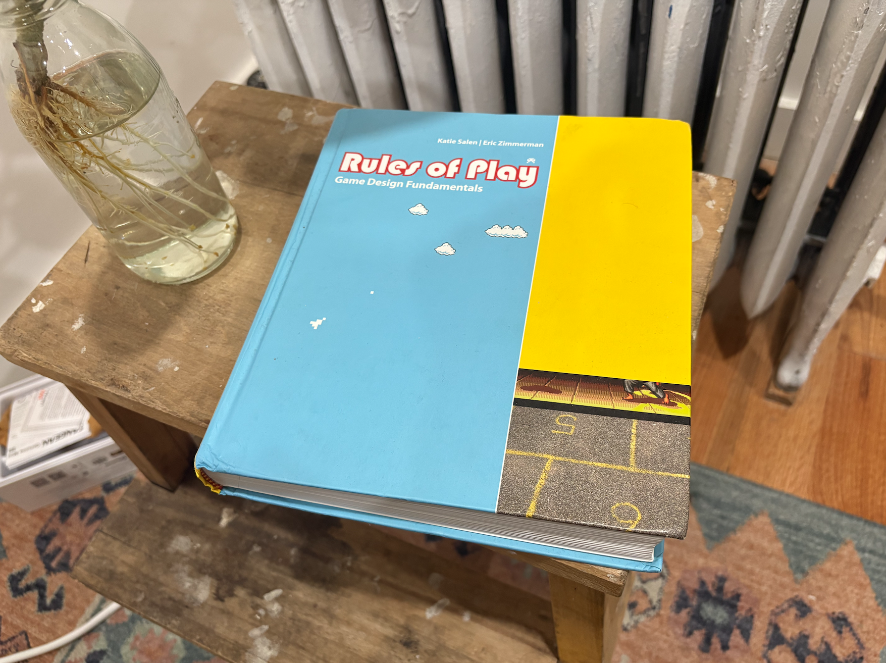

I stewed on this for a while. Since we had already announced the idea of the event, I knew I needed to keep the fundamental formula of "scavenger hunt + hackathon". So, the question became: what mechanism would allow the scavenger hunt to affect the experience of the hackathon? One obvious mechanism would be for the scavenger hunt to somehow determine the _prompt_ for each team's creative coding project, but that approach didn't feel very interesting to me (this was essentially our original idea).

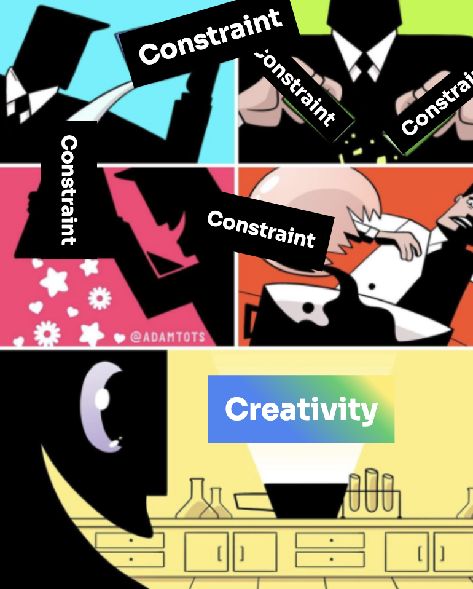

As I kept brainstorming, I was reminded of the saying that "constraint breeds creativity". What if the scavenger hunt somehow resulted in certain creative _constraints_ that each team would need to work within / around during the hackathon? For example, one constraint might require that the team's final result be no more than 64x64 pixels large, and another might forbid the use of color. Maybe, then, the mechanic would be that each scavenger hunt item found allows a team to _remove_ a creative constraint from their team. In other words, if a team doesn't find any items, they have to follow _every_ constraint, and if they find all of them, they can essentially do whatever they want. That wasn't bad, but I felt it could be better. Then, it finally clicked.

## The final design

Instead of starting out saddled with a dozen creative constraints and then removing them one by one, teams would start the scavenger hunt with a clean slate. Each item in the scavenger hunt would be associated with a specific constraint. For example, a living rat is associated with a constraint that forbids the use of Javascript. An analog clock visible from street level is associated with the 64x64 pixel constraint. When a team finds an item, they can impose the associated constraint on _another team_ of their choice to take effect during the hackathon. The concept was simple enough that, when making instructional slides for the event, I could sum the whole thing up in two slides:

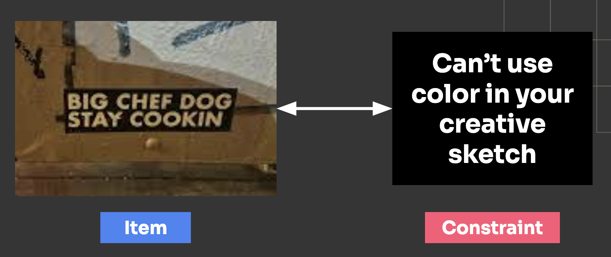

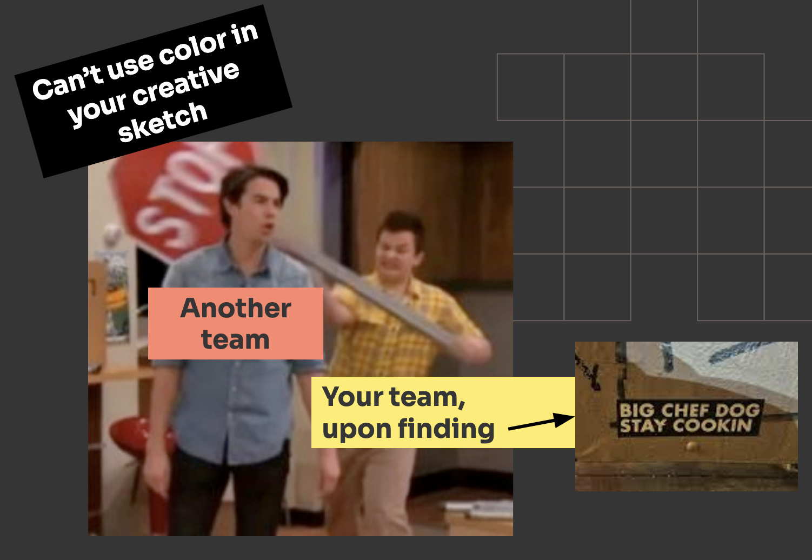

To avoid the situation where every team winds up with the same constraints, we enforce that each item can only be found a certain number of times (I went with four). Then, for the hackathon, we can give a broad prompt like "NYC" and let teams run wild. In my mind, this formulation solved pretty much every issue I had with the event: the scavenger hunt was now integrated into the broader event, there's a good balance between constraint and creativity, and- best of all- we've introduced team interaction.

Plus, there's a bunch of ways to keep the game balanced. For example, I added one item that, when found, allows the team to "veto" one of the constraints put on them. I also enforced a limit of four constraints per team so that one team doesn't get dogpiled.

I had fixed the most glaring issues in the game theory, but there was now a practical issue to solve: How will players know how many of each item there are left? How will they know which constraints have been put on them so far? How will they know which teams already have the maximum number of constraints? Some constraints may be mutually exclusive, how do we enforce that? Now that the game logic was more complex and required synchrony, players need realtime game info. So, I created a web app that supports:

- Seeing the list of scavenger hunt items and their associated constraints, and the number remaining of each
- Seeing all constraints currently placed on your team
- Marking an item as found and choosing a valid team to place that constraint on

The site was made with Typescript/React, and I chose Firebase for my database due to the ease of use.

With the game design fixed and companion web app up at [hunt.ccnyc.space](https://hunt.ccnyc.space), it was time to actually run the thing.

## Running the event

By the time the club's anniversary was rolling around, we had 70 people signed up to participate. Needless to say, I was stoked. On the day before the event, though, bad news struck: the forecast predicted a thunderstorm to hit precisely when the scavenger hunt was set to start. After a few moments of panic, we decided to keep the scavenger hunt on, but to prepare an alternate list of items that could be found without leaving the subway system.

The next day, sure enough, it started pouring just as we organizers began making our way to the venue for setup.

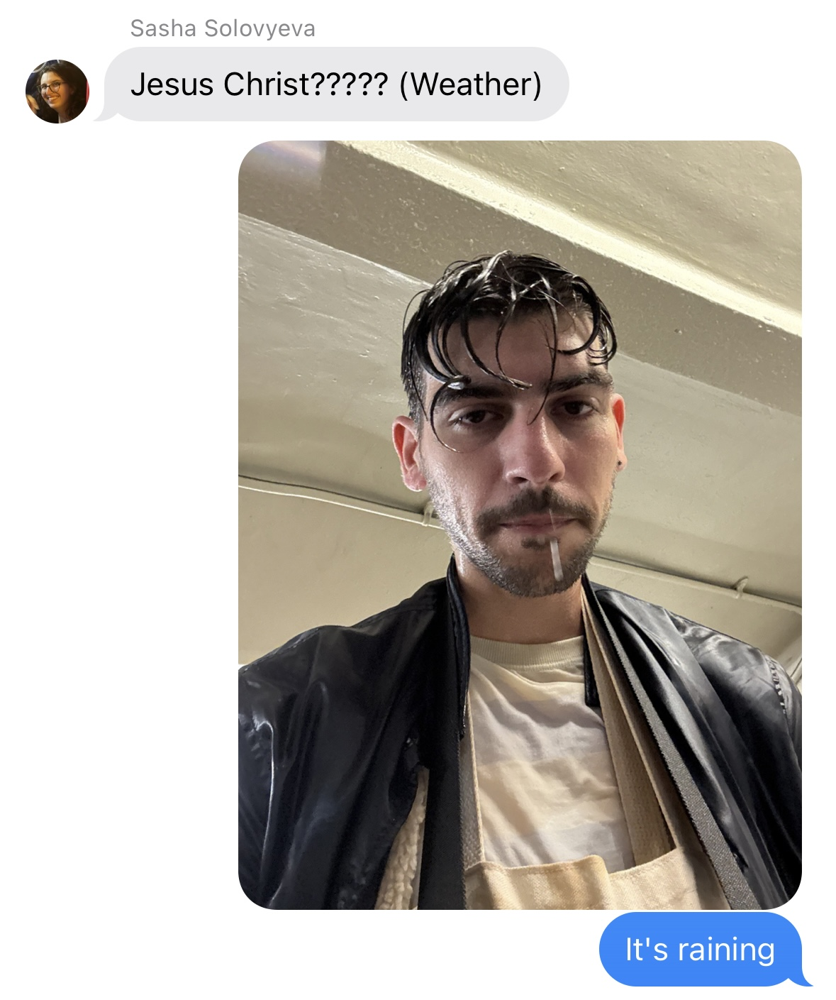

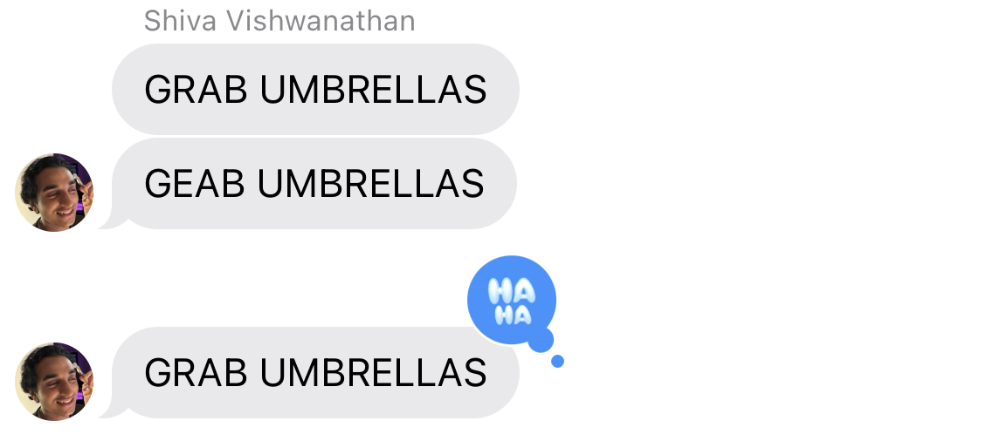

Thankfully, the rain temporarily let up right around the time that people started showing up. I checked people in, (re)assigned teams, and explained the rules. The forecast was also looking less severe, so I asked the group if they wanted to stay underground or brave the aboveground variant; much to my delight, the consensus was for the latter. Once I made sure everyone's team was visible on the site, I sent everybody out the door and took a minute to recoup.

### The scavenger hunt

I had made a WhatsApp group with everyone in the scavenger hunt so that teams could send pictures of the items they found, which served as both a source of realtime updates and crowdsourced verification. Within minutes of teams leaving the venue, my phone was blowing up with pictures of pizza slices, bodega cats, and people reading books on the train. It was something to behold.

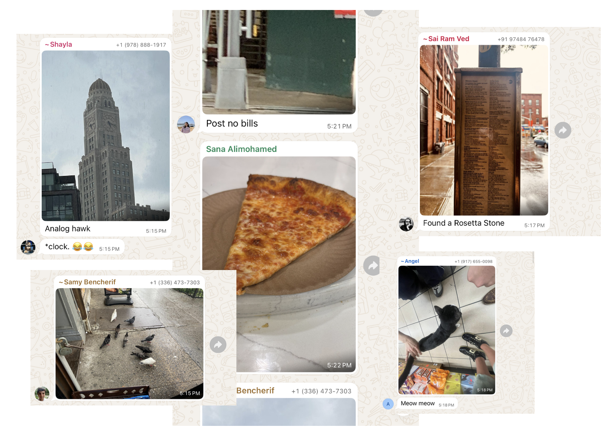

Also within minutes, I got a message that there's a bug on the site: although the site correctly displays how many of each item are left, I forgot to actually prevent users from marking an item as found if there are none left. So, I ducked into a side room and did some good-old live hotfixing.

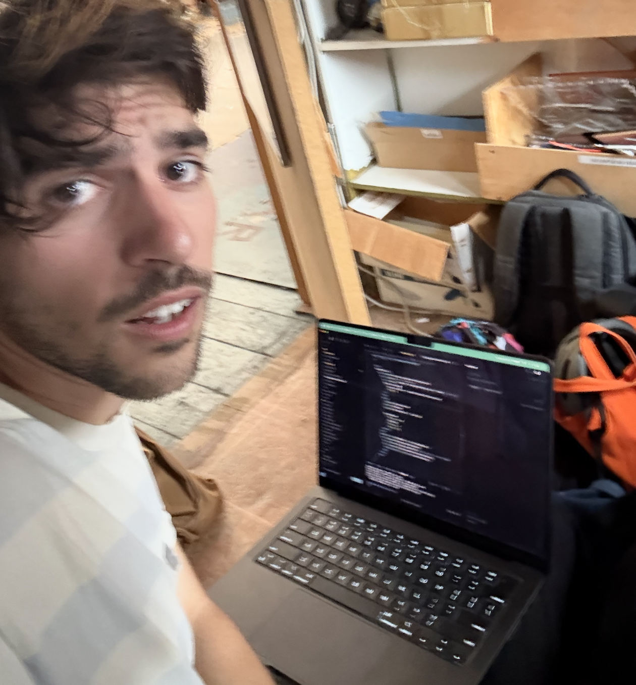

I was endlessly amused by the stream of photos that were rolling into the chat. A few of my favorites include the bodega cats:

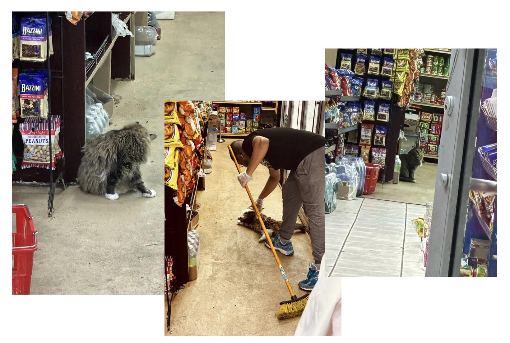

Ginormous slices of pizza:

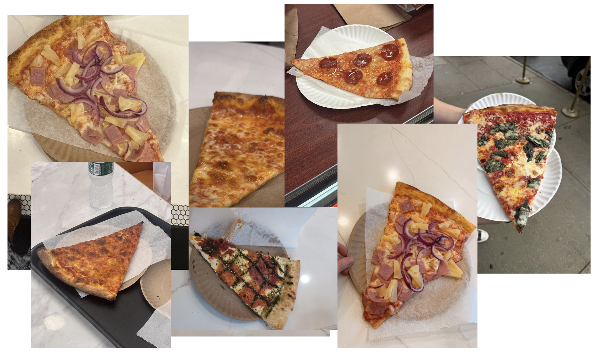

Four different teams took pictures of the exact same metrocard:

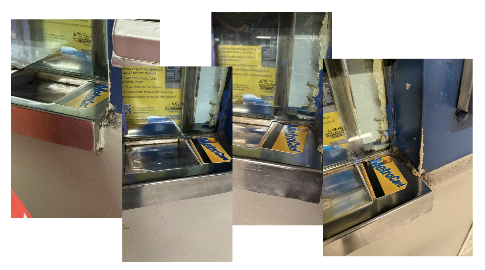

Rats, the city's unofficial mascot:

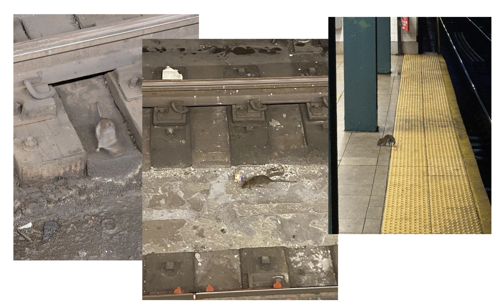

And crime, featuring biking on the sidewalk, fare beating, and blocking a fire hydrant.

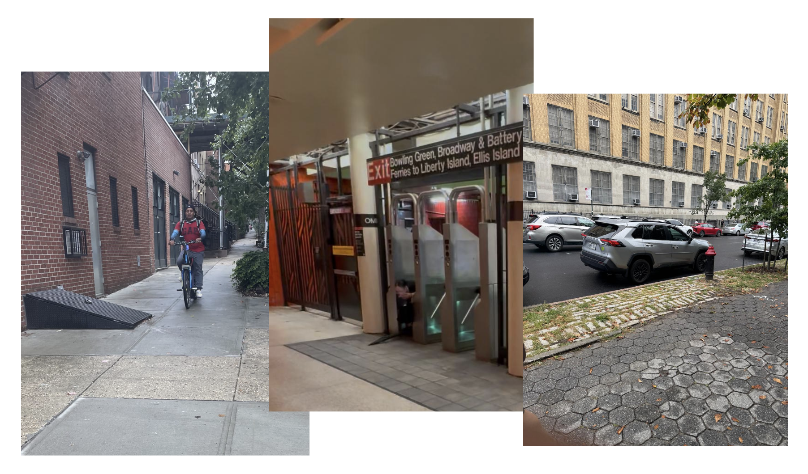

Gradually, folks began streaming back into the venue, which meant it was time for hacking and (more) pizza.

### The hackathon

Thankfully, the hackathon portion of the event more or less ran itself. A few experienced hackers (including creative coding celebrity [Dan Shiffman](https://www.youtube.com/channel/UCvjgXvBlbQiydffZU7m1_aw)) volunteered to walk around and give teams any help they needed. [Jake Welch](https://jakewelch.design/#/) was a fount of knowledge for folks using [p5](https://p5js.org/) for the first time.

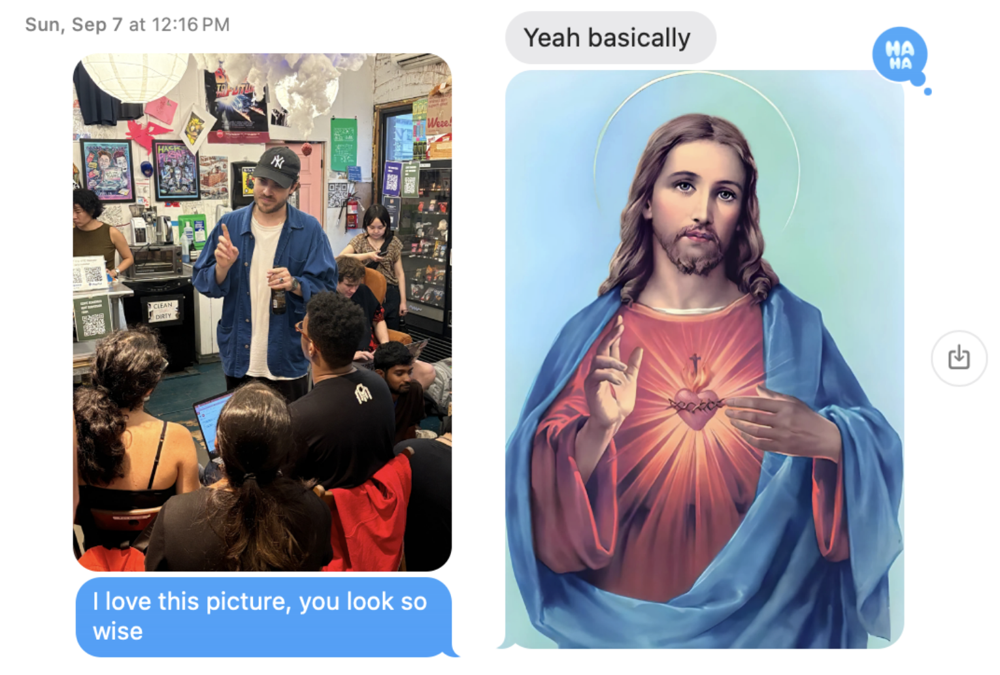

It was a huge relief to hear the room filled with focused chatter and laughter, which I took as an indication that people were actually having _fun_ hacking despite the constraints.

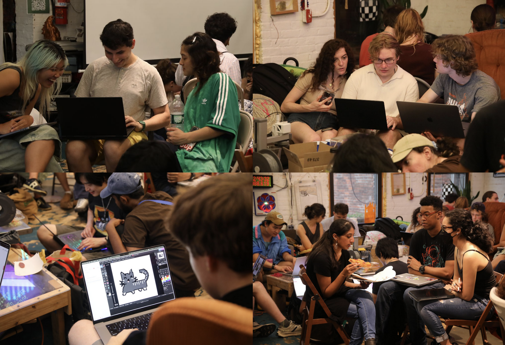

Once time was up, we moved on to a showcase where folks could show off their project and check out other teams' creative sketches. I was honestly blown away by the creativity and diversity I saw across all the projects.

Some of my favorite projects include a game where you try to [yell as loud as a subway train](https://drive.google.com/file/d/1PBsxDtw_ui7fTwoCZHKKq2rF5lLHaKJW/view?usp=sharing) (constraints: no faster than 5fps, <100 loc), an [offline-only emoji-only chatroom](https://drive.google.com/file/d/11SSOYyO0s6OMZvGoPzgXX4p2jXExOFmv/view?usp=sharing) (no color, no text), a [coin-operated binocular simulator](https://drive.google.com/file/d/1a5WEQ_yAssaU7UlYqL_-7Npe9okjp8d-/view?usp=sharing) (64x64 px, no color, no curves, no Python), and a game where you need to [repeatedly type "ps" to placate a bodega cat](https://drive.google.com/file/d/1KOtQSflSVCEKgCl21jw4wR3wFy8ePwlR/view?usp=sharing) (64x64 px, no curves). That last project won our audience popular vote award, and you can see [Josh](https://joshjoshjosh.net/)'s first-hand experience of the whole event [here](https://www.tiktok.com/@joshjoshjosh.net/video/7553511433401601294)!

### Awards

Afterward, we held an awards ceremony to celebrate all the incredible work our participants had created, featuring guest speakers [Xin Xin](https://xin-xin.info/info/) (executive director at the [Processing Foundation](https://processingfoundation.org/)), [Patt Vira](https://www.pattvira.com/) (distinguished online creative coder), and our own Dan Shiffman.

## Wrapping up

Overall, I was immensely happy with how the event went. I had the opportunity to design an fun and novel experience for dozens of people, and it went as well or better than I could have anticipated. Not even the torrential downpour ruined our event, although it certainly threatened to. I'm definitely looking forward to the next time I get to run an event of this type.